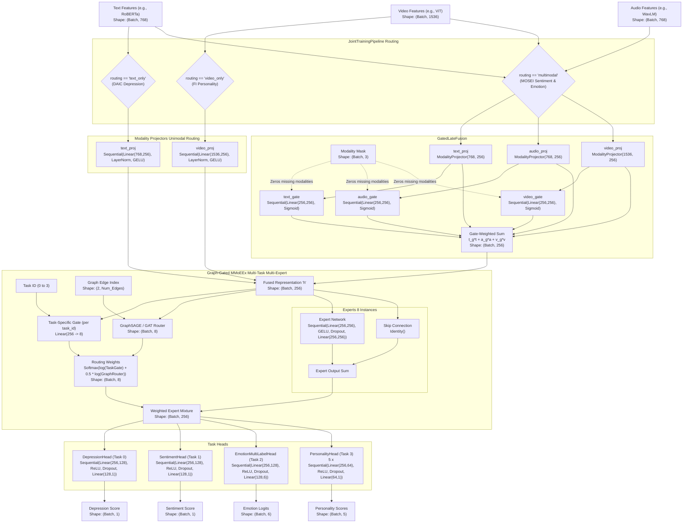
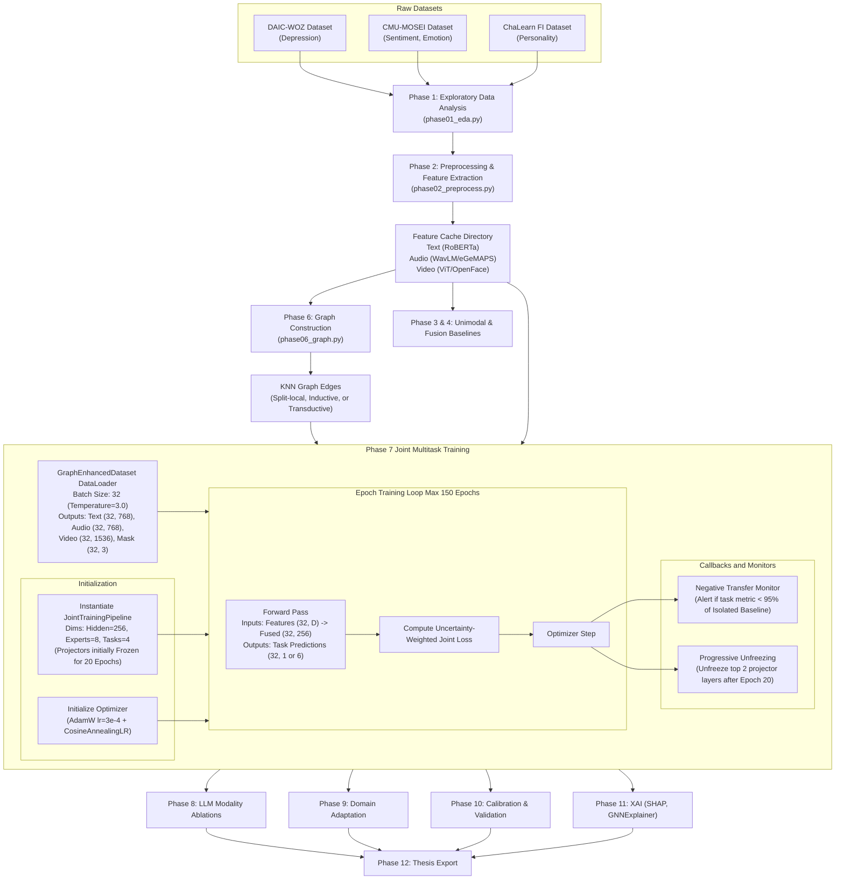

# Exhaustive Codebase Analysis: Experiment 5 Unified Model

## ML Models Architecture Diagram
The following diagram documents the core machine learning architecture as explicitly implemented and instantiated by the `JointTrainingPipeline` in `scripts/phase07_joint_training.py` and defined across `src/models/`.

## Experiment and Process Flow Diagram
The following diagram outlines the full sequential experiment execution flow configured in `scripts/run_full_pipeline.py`, detailing the `phase07_joint_training.py` data flow and monitoring strategy.

## Excluded Components and Justifications
The following components were explicitly analyzed but excluded from the formal diagrams to maintain strict adherence to the explicit, executed architecture of the core Phase 7 pipeline:
1. **`src/models/llm_encoders.py`**: This file contains only Abstract Base Classes (e.g., `LLMTextEncoder`, `TeacherFeatureExtractor`). These are abstractions meant for Phase 8 ablation testing and are not concrete layers instantiated in the primary joint model's forward pass.
2. **Alternative Fusion Models (`CrossAttentionFusion`, `LowRankMultimodalFusion`, `LowRankGatingNetwork` in `src/models/fusion.py`)**: While fully implemented, the main `JointTrainingPipeline` relies strictly on `GatedLateFusion`. The alternative methods represent modular swaps, primarily utilized in Phase 4 baselines, and their inclusion would misrepresent the active Phase 7 architecture.
3. **Low-level Loaders (`src/data/mpdd_loader.py`, `src/data/daic_loader.py`)**: These are abstracted beneath the `MultimodalDataset` and the `GraphEnhancedDataset`. The diagrams focus on the cached feature flow and the unified PyG dataset used in training.
4. **Evaluation and Training Utilities (`src/training/calibration.py`, `src/training/losses.py`, `src/evaluation/*`)**: Excluded from the NN architecture diagram as they compute metrics, apply post-hoc calibration (Phase 10), or calculate losses outside the bounds of the tensor shape transformations occurring within the model's direct forward pass.
