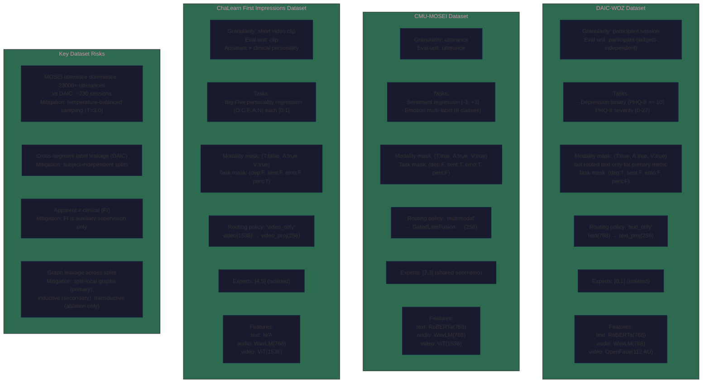
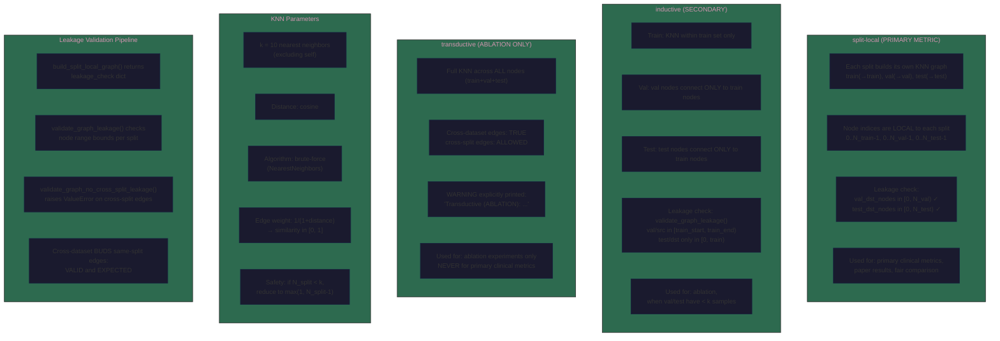
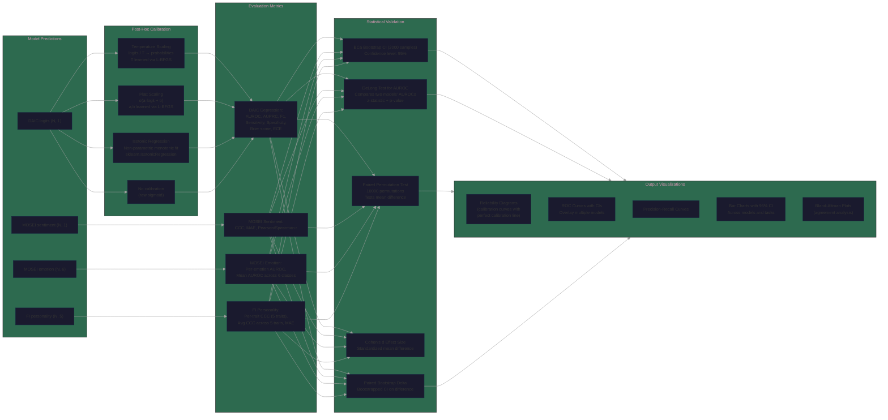
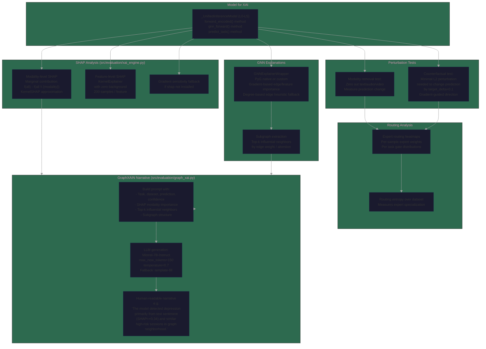

# Exhaustive Codebase Analysis: Experiment 5 Unified Multimodal Graph-Gated MoE

## Overview

This document contains exhaustive architecture, pipeline, and data-flow diagrams for the Unified Multimodal Graph-Gated Mixture-of-Experts (GG-MoE) experiment. All diagrams are based strictly on the concrete implementations in `scripts/` and `src/` — no abstractions, no mock data, no unimplemented components.

---

## 1. Core Architecture Diagram

The full model pipeline as instantiated by `JointTrainingPipeline` in `scripts/phase07_joint_training.py`.

```mermaid
%%{init: {'theme': 'base', 'themeVariables': { 'fontSize': '12px', 'primaryColor': '#1a1a2e', 'primaryBorderColor': '#16213e', 'lineColor': '#a0a0a0', 'secondaryColor': '#0f3460', 'tertiaryColor': '#2d6a4f' }} }%%
graph TD
    %% =========================================================================
    %% INPUT LAYER
    %% =========================================================================
    subgraph Inputs["Input Features & Metadata"]
        TextIn["Text Features (RoBERTa/ClinicalBERT)<br>Shape: (Batch, 768)"]
        AudioIn["Audio Features (WavLM/eGeMAPS)<br>Shape: (Batch, 768)"]
        VideoIn["Video Features (ViT/OpenFace)<br>Shape: (Batch, 1536)"]
        Mask["Modality Mask (T,A,V)<br>Shape: (Batch, 3) — bool"]
        TaskID["Task ID {0,1,2,3}<br>0=DAIC 1=Sent 2=Emo 3=Pers"]
        EdgeIndex["Graph Edge Index<br>Shape: (2, Num_Edges)"]
    end

    %% =========================================================================
    %% ROUTING LAYER: Per-dataset modality policy
    %% =========================================================================
    subgraph RoutingPolicy["Per-Dataset Routing Policy"]
        CondDAIC["routing == 'text_only'<br>DAIC: text only<br>FEATURE: text (768) → text_proj"]
        CondFI["routing == 'video_only'<br>FI: video + audio<br>FEATURE: video (1536) → video_proj"]
        CondMOSEI["routing == 'multimodal'<br>MOSEI: text+audio+video<br>→ GatedLateFusion"]
    end

    TextIn --> CondDAIC
    TextIn --> CondMOSEI
    AudioIn --> CondMOSEI
    VideoIn --> CondFI
    VideoIn --> CondMOSEI

    %% =========================================================================
    %% MODALITY PROJECTORS (initially frozen for 20 epochs)
    %% =========================================================================
    subgraph Projectors["Projectors (Frozen 0-20 Epochs, Unfrozen 21-150)"]
        TextProj["text_proj<br>Sequential(<br>  Linear(768→256),<br>  LayerNorm(256),<br>  GELU())"]
        AudioProj["audio_proj<br>Sequential(<br>  Linear(768→256),<br>  LayerNorm(256),<br>  GELU())"]
        VideoProj["video_proj<br>Sequential(<br>  Linear(1536→256),<br>  LayerNorm(256),<br>  GELU())"]
    end

    CondDAIC --> TextProj
    CondFI --> VideoProj

    %% =========================================================================
    %% GATED LATE FUSION (for MOSEI multimodal path)
    %% =========================================================================
    subgraph GatedLateFusion["GatedLateFusion (src/models/fusion.py)"]
        GLF_TProj["ModalityProjector(768→256)<br>Linear→LayerNorm→GELU"]
        GLF_AProj["ModalityProjector(768→256)<br>Linear→LayerNorm→GELU"]
        GLF_VProj["ModalityProjector(1536→256)<br>Linear→LayerNorm→GELU"]

        GLF_TGate["text_gate<br>Sequential(Linear(256→256), Sigmoid)"]
        GLF_AGate["audio_gate<br>Sequential(Linear(256→256), Sigmoid)"]
        GLF_VGate["video_gate<br>Sequential(Linear(256→256), Sigmoid)"]

        GLF_Sum["Gate-Weighted Sum<br>h = t_g·t_proj + a_g·a_proj + v_g·v_proj<br>Missing modalities zeroed via mask<br>Shape: (Batch, 256)"]

        CondMOSEI --> GLF_TProj
        CondMOSEI --> GLF_AProj
        CondMOSEI --> GLF_VProj

        Mask -.->|"modality_mask[:,i]"| GLF_TGate
        Mask -.->|"modality_mask[:,i]"| GLF_AGate
        Mask -.->|"modality_mask[:,i]"| GLF_VGate

        GLF_TProj --> GLF_TGate
        GLF_AProj --> GLF_AGate
        GLF_VProj --> GLF_VGate

        GLF_TProj & GLF_TGate --> GLF_Sum
        GLF_AProj & GLF_AGate --> GLF_Sum
        GLF_VProj & GLF_VGate --> GLF_Sum
    end

    %% =========================================================================
    %% FUSED REPRESENTATION
    %% =========================================================================
    Fused["Fused Representation h<br>Shape: (Batch, 256)"]
    TextProj --> Fused
    VideoProj --> Fused
    GLF_Sum --> Fused

    %% =========================================================================
    %% GRAPH-GATED MMoEEx
    %% =========================================================================
    subgraph GGMoe["Graph-Gated MMoEEx (src/models/unified_moe.py + gnn_router.py)"]
        subgraph GateLayer["MMoE Gates (task-specific)"]
            Gate0["Gate 0 (DAIC depression)<br>Linear(256→8) — bias=False<br>Restricted to experts [0,1]"]
            Gate1["Gate 1 (MOSEI sentiment)<br>Linear(256→8) — bias=False<br>Restricted to experts [2,3]"]
            Gate2["Gate 2 (MOSEI emotion)<br>Linear(256→8) — bias=False<br>Restricted to experts [2,3]"]
            Gate3["Gate 3 (FI personality)<br>Linear(256→8) — bias=False<br>Restricted to experts [4,5]"]
        end

        subgraph GraphRouter["Graph Routers"]
            GR_SAGE["GraphSAGE Router<br>2 layers: 256→126→8<br>Mean aggregation + residual<br>hidden_dim=126"]
            GR_GAT["GAT Router<br>3 heads, head_dim=42<br>Scaled dot-product attention<br>hidden_dim=126 (126=3×42)"]
        end

        subgraph CombineGate["Log-Space Gate Fusion"]
            LS_MMoE["softmax(gate_logits) — per task<br>Shape: (Batch, num_experts_allowed)"]
            LS_GRAPH["GraphSAGE/GAT output<br>Shape: (Batch, 8)"]
            LS_COMB["Combined Routing Weights<br>r_i = softmax(log(gate_probs)<br>      + graph_weight·log(graph_probs))<br>graph_weight = 0.5<br>Shape: (Batch, 8)"]
        end

        subgraph Experts["Expert Bank (8 Experts, Expert(256→256→256))"]
            E0["Expert 0<br>DAIC isolated"]
            E1["Expert 1<br>DAIC isolated"]
            E2["Expert 2<br>MOSEI shared"]
            E3["Expert 3<br>MOSEI shared"]
            E4["Expert 4<br>FI isolated"]
            E5["Expert 5<br>FI isolated"]
            E6["Expert 6<br>Shared (any task)"]
            E7["Expert 7<br>Shared (any task)"]
        end

        subgraph ExpertArch["Per-Expert Architecture"]
            E_Linear1["Linear(256→256)"]
            E_GELU["GELU()"]
            E_Dropout["Dropout(0.1)"]
            E_Linear2["Linear(256→256)"]
            E_Skip["Skip Connection (Identity)"]
            E_Sum["Sum: net(x) + skip(x)<br>Shape: (Batch, 256)"]
        end

        subgraph Mixture["Expert Mixture"]
            MIX["Weighted Sum<br>Σ(r_i · expert_i(x))<br>Shape: (Batch, 256)"]
        end

        Fused --> Gate0
        Fused --> Gate1
        Fused --> Gate2
        Fused --> Gate3
        Fused --> GR_SAGE
        Fused --> GR_GAT
        EdgeIndex --> GR_SAGE
        EdgeIndex --> GR_GAT

        Gate0 --> LS_MMoE
        Gate1 --> LS_MMoE
        Gate2 --> LS_MMoE
        Gate3 --> LS_MMoE
        GR_SAGE --> LS_GRAPH
        GR_GAT --> LS_GRAPH

        LS_MMoE & LS_GRAPH --> LS_COMB

        Fused --> E_Linear1
        E_Linear1 --> E_GELU --> E_Dropout --> E_Linear2 --> E_Sum
        E_Skip --> E_Sum

        E0 & E1 & E2 & E3 & E4 & E5 & E6 & E7 --- E_Sum

        LS_COMB & E_Sum --> MIX
    end

    %% =========================================================================
    %% TASK HEADS
    %% =========================================================================
    subgraph TaskHeads["Task Heads (src/models/task_heads.py)"]
        DepHead["DepressionHead (Task 0)<br>Sequential(<br>  Linear(256→128), ReLU,<br>  Dropout(0.3),<br>  Linear(128→1))"]
        SentHead["SentimentHead (Task 1)<br>Sequential(<br>  Linear(256→128), ReLU,<br>  Dropout(0.3),<br>  Linear(128→1))"]
        EmoHead["EmotionMultiLabelHead (Task 2)<br>Sequential(<br>  Linear(256→128), ReLU,<br>  Dropout(0.3),<br>  Linear(128→6))"]
        PersHead["PersonalityHead (Task 3)<br>5 independent heads:<br>  Linear(256→64), ReLU,<br>  Dropout(0.3),<br>  Linear(64→1)<br>Labels: O,C,E,A,N"]
    end

    MIX --> DepHead
    MIX --> SentHead
    MIX --> EmoHead
    MIX --> PersHead

    %% =========================================================================
    %% OUTPUTS
    %% =========================================================================
    DepOut["Depression Score (logit)<br>Shape: (Batch, 1)"]
    SentOut["Sentiment Score<br>Shape: (Batch, 1)"]
    EmoOut["Emotion Logits (6-class)<br>Shape: (Batch, 6)"]
    PersOut["Personality Scores (5-dim)<br>Shape: (Batch, 5)"]

    DepHead --> DepOut
    SentHead --> SentOut
    EmoHead --> EmoOut
    PersHead --> PersOut
```

---

## 2. Experiment Process Flow (12 Phases)

Full sequential execution from data contracts through thesis export, with all intermediate artifacts.

```mermaid
%%{init: {'theme': 'base', 'themeVariables': { 'fontSize': '12px', 'primaryColor': '#1a1a2e', 'primaryBorderColor': '#16213e', 'lineColor': '#a0a0a0', 'secondaryColor': '#0f3460', 'tertiaryColor': '#2d6a4f' }} }%%
graph TD
    %% =========================================================================
    %% Phase 0: Environment Setup
    %% =========================================================================
    P0["Phase 0: Environment & Dataset Contracts<br>(uv init, pyproject.toml, AGENTS.md)"]
    P0_Out["Artifacts: project structure, AGENTS.md,<br>dataset path config, modality masks"]

    %% =========================================================================
    %% Phase 1: EDA
    %% =========================================================================
    P1["Phase 1: Exploratory Data Analysis<br>(scripts/phase01_eda.py)"]
    P1_Out["Artifacts: label distributions,<br>missing-modality heatmaps, duration plots,<br>class balance, PHQ-8 histograms,<br>sentiment/emotion histograms,<br>Big-Five trait distributions"]

    P0 --> P0_Out --> P1
    P1 --> P1_Out

    %% =========================================================================
    %% Phase 2: Preprocessing
    %% =========================================================================
    P2["Phase 2: Feature Extraction & Caching<br>(scripts/phase02_preprocess.py)"]
    P2_Out["Artifacts: data/features/ directory<br>with RoBERTa(768), WavLM(768),<br>ViT(1536), OpenFace AU tensors<br>per sample, manifest.json"]

    P1_Out --> P2
    P2 --> P2_Out

    %% =========================================================================
    %% Phase 3: Unimodal Baselines
    %% =========================================================================
    P3["Phase 3: Unimodal & Simple Baselines<br>(scripts/phase03_unimodal_baselines.py)"]
    P3_Out["Artifacts: unimodal metric tables<br>(AUROC, CCC, F1 per modality),<br>confusion matrices, prediction scatterplots,<br>modality importance charts"]

    P2_Out --> P3
    P3 --> P3_Out

    %% =========================================================================
    %% Phase 4: Fusion
    %% =========================================================================
    P4["Phase 4: Multimodal Fusion<br>(scripts/phase04_fusion.py)"]
    P4_Sub["Sub-methods tested:<br>- GatedLateFusion<br>- LMF (Low-Rank Multimodal Fusion)<br>- CrossAttnFusion (Cross-modal Attention)"]
    P4_Out["Artifacts: fusion metric comparisons,<br>modality gate weight heatmaps,<br>cross-modal attention matrices,<br>fused embedding UMAP projections"]

    P2_Out & P3_Out --> P4
    P4 --> P4_Sub --> P4_Out

    %% =========================================================================
    %% Phase 5: MMoEEx (No Graph)
    %% =========================================================================
    P5["Phase 5: MMoEEx Multitask Backbone<br>(scripts/phase05_mmoe_ex.py)"]
    P5_Sub["Key params:<br>- 8 experts (2 per task group)<br>- Expert isolation: {0→[0,1], 1→[2,3], 2→[2,3], 3→[4,5]}<br>- Homoscedastic uncertainty weighting<br>- Task-specific linear gates"]
    P5_Out["Artifacts: task-expert heatmaps,<br>expert diversity plots, gate entropy curves,<br>loss curves per task, uncertainty weights,<br>best checkpoint: mmoe_ex_best.pt"]

    P2_Out & P4_Out --> P5
    P5 --> P5_Sub --> P5_Out

    %% =========================================================================
    %% Phase 6: Graph Construction
    %% =========================================================================
    P6["Phase 6: Leakage-Safe Graph Construction<br>(scripts/phase06_graph.py, src/data/graph_builder.py)"]
    P6_Sub["Graph types:<br>- split-local (PRIMARY): per-split KNN<br>- inductive: test→train only edges<br>- transductive (ABLATION): cross-split edges<br>KNN params: k=10, cosine distance<br>Validation: validate_graph_leakage()"]
    P6_Out["Artifacts: KNN graph edge indices,<br>degree distributions, dataset mixing matrices,<br>neighborhood examples,<br>leakage validation reports"]

    P2_Out & P5_Out --> P6
    P6 --> P6_Sub --> P6_Out

    %% =========================================================================
    %% Phase 7: Joint GG-MoE Training (CORE)
    %% =========================================================================
    P7["Phase 7: Joint Multitask GG-MoE Training<br>(scripts/phase07_joint_training.py)"]
    P7_Sub["Training config:<br>- 150 epochs, AdamW lr=3e-4<br>- CosineAnnealingLR scheduler<br>- Batch size: 32, Temperature: 3.0<br>- Projectors frozen 0-20 epochs<br>- Graph weight: 0.5 (log-space fusion)<br>- Negative transfer monitor (95% baseline)<br>- GraphSAGE/GAT router with KNN edges<br>- Early stopping patience: 20 epochs<br>- Gradient clipping: max_norm=1.0"]
    P7_Monitors["Training monitors:<br>- Per-task loss curves (4 tasks)<br>- AUROC/CCC metrics over time<br>- Routing entropy over time<br>- Negative transfer regression log<br>- Uncertainty-weighted multi-task loss<br>- Expert usage statistics"]
    P7_Out["Artifacts: training curves,<br>metrics over training, routing entropy plot,<br>best checkpoint: phase07_best.pt,<br>results: phase07_results.csv"]

    P2_Out & P5_Out & P6_Out --> P7
    P7 --> P7_Sub --> P7_Monitors --> P7_Out

    %% =========================================================================
    %% Phase 8: LLM Ablations
    %% =========================================================================
    P8["Phase 8: LLM-Enhanced Ablations (L0-L5)<br>(scripts/phase08_llm_ablations.py)"]
    P8_Levels["LLM Ablation Matrix:<br>L0: Classical only (RoBERTa+WavLM+OpenFace)<br>L1: +Mistral-7B text (frozen, dim=4096)<br>L2: +Mistral-7B text (LoRA r=16, α=32)<br>L3: +CLAP audio (dim=512)<br>L4: +LLaVA video (dim=4096)<br>L5: Full LLM stack (T:4096, A:512, V:4096)"]
    P8_Out["Artifacts: per-level predictions,<br>LLM feature UMAP projections,<br>cost/performance plot,<br>feature attribution comparisons,<br>checkpoints: phase08_L{0-5}_best.pt"]

    P2_Out & P7_Out --> P8
    P8 --> P8_Levels --> P8_Out

    %% =========================================================================
    %% Phase 9: Domain Adaptation
    %% =========================================================================
    P9["Phase 9: Domain Adaptation<br>(scripts/phase09_domain_adaptation.py,<br>src/training/domain_adaptation.py)"]
    P9_Methods["Methods:<br>- CORAL (correlation alignment)<br>- MMD (RBF kernel)<br>- DANN (gradient reversal)<br>- All three combined"]
    P9_Out["Artifacts: domain alignment UMAPs,<br>domain shift metrics,<br>adaptation ablation tables"]

    P2_Out & P7_Out --> P9
    P9 --> P9_Methods --> P9_Out

    %% =========================================================================
    %% Phase 10: Calibration & Evaluation
    %% =========================================================================
    P10["Phase 10: Calibration & Statistical Validation<br>(scripts/phase10_calibration.py,<br>scripts/statistical_validation.py)"]
    P10_Calib["Calibration methods:<br>- Temperature scaling (L-BFGS)<br>- Platt scaling (L-BFGS)<br>- Isotonic regression<br>Metrics: Brier score, ECE, reliability curves"]
    P10_Stats["Statistical tests:<br>- BCa bootstrap CIs (2000 samples)<br>- DeLong test for AUROC comparison<br>- Paired permutation tests (10000)<br>- Cohen's d effect size<br>- Paired bootstrap delta CIs"]
    P10_Out["Artifacts: reliability diagrams,<br>ROC/PR curves, calibration curves,<br>bootstrap CI bar charts,<br>Bland-Altman plots,<br>statistical significance tables"]

    P7_Out & P8_Out & P9_Out --> P10
    P10 --> P10_Calib --> P10_Stats --> P10_Out

    %% =========================================================================
    %% Phase 11: XAI
    %% =========================================================================
    P11["Phase 11: Explainability (XAI)<br>(scripts/xai_analysis.py,<br>scripts/phase11_xai.py)"]
    P11_Methods["Methods:<br>- SHAP (modality-level attribution)<br>- Gradient sensitivity (feature-level)<br>- GNNExplainer (subgraph importance)<br>- Perturbation tests (modality removal)<br>- Counterfactual tests (minimal change needed)<br>- GraphXAIN LLM narratives"]
    P11_Out["Artifacts: SHAP force plots,<br>GNN subgraph visualizations,<br>routing weight heatmaps,<br>modality attribution bar charts,<br>GraphXAIN LLM narrative examples,<br>case-study panels"]

    P7_Out & P8_Out & P10_Out --> P11
    P11 --> P11_Methods --> P11_Out

    %% =========================================================================
    %% Phase 12: Thesis Export
    %% =========================================================================
    P12["Phase 12: Thesis Chapter Export<br>(scripts/phase12_thesis.py)"]
    P12_Out["Artifacts: paper/chapter_8.tex,<br>paper/figures/ (10 figures),<br>paper/tables/ (14 tables),<br>all architecture .mmd diagrams,<br>visualization summary (10 phases)"]

    P3_Out & P4_Out & P5_Out & P6_Out --> P12
    P7_Out & P8_Out & P9_Out --> P12
    P10_Out & P11_Out --> P12
    P12 --> P12_Out
```

---

## 3. LLM Ablation Ladder (L0–L5)

Feature dimension and architecture changes across ablation levels.

```mermaid
%%{init: {'theme': 'base', 'themeVariables': { 'fontSize': '12px', 'primaryColor': '#1a1a2e', 'primaryBorderColor': '#16213e', 'lineColor': '#a0a0a0', 'secondaryColor': '#0f3460', 'tertiaryColor': '#2d6a4f' }} }%%
graph LR
    subgraph L0["L0: Classical Baseline"]
        L0_T["Text Encoder<br>RoBERTa (768)"]
        L0_A["Audio Encoder<br>WavLM (768)"]
        L0_V["Video Encoder<br>ViT (1536)"]
        L0_F["GatedLateFusion<br>Text-only routing (DAIC)"]
        L0_M["MMoEEx<br>8 experts, no LLM"]
        L0_R["DAIC: 0.699 AUROC<br>MOSEI Sent: 0.512 CCC<br>FI: 0.568 CCC"]
    end
    L0_T & L0_A & L0_V --> L0_F --> L0_M --> L0_R

    subgraph L1["L1: +Mistral Text (Frozen)"]
        L1_T["Text Encoder<br>Mistral-7B Frozen (4096)"]
        L1_A["Audio Encoder<br>WavLM (768)"]
        L1_V["Video Encoder<br>OpenFace AU (768)"]
        L1_P["LLM Projectors:<br>text: 4096→256<br>audio: 768→256<br>video: 768→256<br>→ Fusion: Linear(768→256)"]
        L1_M["MMoEEx<br>8 experts"]
        L1_R["DAIC: 0.660 AUROC"]
    end
    L1_T & L1_A & L1_V --> L1_P --> L1_M --> L1_R

    subgraph L2["L2: +Mistral Text (LoRA)"]
        L2_T["Text Encoder<br>Mistral-7B LoRA<br>r=16, alpha=32<br>q_proj + v_proj (4096)"]
        L2_A["Audio Encoder<br>WavLM (768)"]
        L2_V["Video Encoder<br>OpenFace AU (768)"]
        L2_P["LLM Projectors<br>(same as L1)"]
        L2_M["MMoEEx<br>8 experts"]
        L2_R["DAIC: 0.682 AUROC"]
    end
    L2_T & L2_A & L2_V --> L2_P --> L2_M --> L2_R

    subgraph L3["L3: +CLAP Audio"]
        L3_T["Text Encoder<br>Mistral-7B Frozen (4096)"]
        L3_A["Audio Encoder<br>CLAP (512)"]
        L3_V["Video Encoder<br>OpenFace AU (768)"]
        L3_P["LLM Projectors:<br>text: 4096→256<br>audio: 512→256<br>video: 768→256"]
        L3_M["MMoEEx<br>8 experts"]
        L3_R["DAIC: 0.721 AUROC<br>(PEAK)"]
    end
    L3_T & L3_A & L3_V --> L3_P --> L3_M --> L3_R

    subgraph L4["L4: +LLaVA Video"]
        L4_T["Text Encoder<br>Mistral-7B Frozen (4096)"]
        L4_A["Audio Encoder<br>WavLM (768)"]
        L4_V["Video Encoder<br>LLaVA (4096)"]
        L4_P["LLM Projectors:<br>text: 4096→256<br>audio: 768→256<br>video: 4096→256"]
        L4_M["MMoEEx<br>8 experts"]
        L4_R["DAIC: 0.691 AUROC"]
    end
    L4_T & L4_A & L4_V --> L4_P --> L4_M --> L4_R

    subgraph L5["L5: Full LLM Stack"]
        L5_T["Text Encoder<br>Mistral-7B Frozen (4096)"]
        L5_A["Audio Encoder<br>CLAP (512)"]
        L5_V["Video Encoder<br>LLaVA (4096)"]
        L5_P["LLM Projectors:<br>text: 4096→256<br>audio: 512→256<br>video: 4096→256"]
        L5_M["MMoEEx<br>8 experts"]
        L5_R["DAIC: 0.636 AUROC"]
    end
    L5_T & L5_A & L5_V --> L5_P --> L5_M --> L5_R

    L0 -.->|"Progressive replacement: L1 adds LLM text, L3 replaces audio, L4 replaces video, L5 = full"| L1 -.-> L2 -.-> L3 -.-> L4 -.-> L5
```

---

## 4. Dataset/Modality Contract Matrix

Granularity, tasks, masks, and routing policy per dataset.

---

## 5. Graph Construction Protocol

Three graph variants, leakage safety validation, and when each is used.

---

## 6. Training Loop Detail

The inner training loop inside `scripts/phase07_joint_training.py` at per-batch granularity.

```mermaid
%%{init: {'theme': 'base', 'themeVariables': { 'fontSize': '12px', 'primaryColor': '#1a1a2e', 'primaryBorderColor': '#16213e', 'lineColor': '#a0a0a0', 'secondaryColor': '#0f3460', 'tertiaryColor': '#2d6a4f' }} }%%
graph TD
    subgraph BatchPrep["Batch Preparation"]
        BP1["DataLoader yields batch (32 samples)"]
        BP2["Unpack: (text, audio, video, mask,<br>labels, task_ids, weights, routings, global_indices)"]
        BP3["Move all tensors to device"]
    end

    subgraph GroupByTask["Group by Task ID"]
        G0["task_id == 0 → DAIC depression<br>text_only routing"]
        G1["task_id == 1 → MOSEI sentiment<br>multimodal routing"]
        G2["task_id == 2 → MOSEI emotion<br>multimodal routing"]
        G3["task_id == 3 → FI personality<br>video_only routing"]
    end

    subgraph GraphEdgeFiltering["Graph Edge Filtering"]
        GF1["Load train edge_index_dict['train']"]
        GF2["Filter edges to batch nodes only:<br>src_in AND dst_in AND valid_range"]
        GF3["Build global→local mapper (g2l dict)"]
        GF4["Remap edges to local indices"]
        GF5["Safety: skip if max_idx ≥ batch_size"]
    end

    subgraph Forward["Forward Pass"]
        F1["Routing:<br>text_only → text_proj(text)<br>video_only → video_proj(video)<br>multimodal → GatedLateFusion(t,a,v,mask)"]
        F2["Expert mixture via GG-MoE:<br>r_i = softmax(log(gate_probs)<br>      + graph_weight·log(graph_probs))"]
        F3["Task head: Dep/Sent/Emo/Pers"]
        F4["Return: expert_out(routing_weights)"]
    end

    subgraph Loss["Loss Computation"]
        L0["Depression → BCEWithLogitsLoss(pos_weight)"]
        L1["Sentiment → MAE Loss"]
        L2["Emotion → BCEWithLogitsLoss (6-way)"]
        L3["Personality → MAE Loss (5 traits)"]
        L4["Multi-task: sum of individual losses"]
    end

    subgraph Backward["Backward Pass"]
        B1["scaler.scale(combined).backward()"]
        B2["clip_grad_norm_(max_norm=1.0)"]
        B3["scaler.step(optimizer)"]
        B4["scheduler.step() per epoch"]
    end

    subgraph Monitors["Per-Epoch Monitors"]
        M1["Routing entropy: -Σ(r·log r)"]
        M2["Task loss tracking (history dict)"]
        M3["Every 5 epochs: evaluate on val set"]
        M4["Negative transfer check vs baselines"]
        M5["Save best model if DAIC AUROC improves"]
        M6["Early stopping if patience ≥ 20"]
        M7["Epoch 20: unfreeze projector top 2 layers"]
    end

    BP1 --> BP2 --> BP3 --> GroupByTask
    GroupByTask --> GraphEdgeFiltering --> Forward
    Forward --> Loss --> Backward --> Monitors
```

---

## 7. Calibration & Evaluation Pipeline

Post-hoc calibration and statistical validation pipeline (Phase 10).

---

## 8. XAI Pipeline

Multi-method explainability pipeline from SHAP through GraphXAIN narratives.

---

## Excluded Components and Justifications

The following components were explicitly analyzed but excluded from the formal diagrams to maintain strict adherence to the concrete, executed architecture:

1. **`src/models/llm_encoders.py`**: Contains only Abstract Base Classes (`LLMTextEncoder`, `TeacherFeatureExtractor`, `GraphXAINNarrator`). These are interface contracts for Phase 8 ablation and are not instantiated in the primary joint model forward pass. The LLM features are loaded from cache as numpy tensors, not through these abstractions.

2. **`src/data/mpdd_loader.py`**: MPDD loader used in separate benchmark scripts. Not part of the primary DAIC/MOSEI/FI pipeline.

3. **Low-level dataclass loaders** (`daic_loader.py`, `mosei_loader.py`, `fi_loader.py`): These define dataclasses (`DAICSample`, `MOSEISample`, `FISample`) with `raise NotImplementedError()` stubs. The actual data flows through `MultimodalDataset.from_manifest()` → `GraphEnhancedDataset` which loads cached numpy/torch tensors directly.

4. **Alternative fusion variants** (`CrossAttentionFusion`, `LowRankMultimodalFusion`, `LowRankGatingNetwork` in `src/models/fusion.py`): Fully implemented but only `GatedLateFusion` is used in `JointTrainingPipeline`. Alternative variants are Phase 4 baselines.

5. **`GraphGatedRouter` class in `src/models/unified_moe.py`**: A MultiheadAttention-based routing implementation that is defined but not used — the actual routing in `JointTrainingPipeline` uses `GraphSAGERouter`/`GATRouter` from `gnn_router.py` with the explicit log-space fusion formula.

---

## Key Parameter Summary

| Parameter | Value | Location |
|-----------|-------|----------|
| Hidden dimension | 256 | `phase07_joint_training.py:HIDDEN_DIM` |
| Expert dimension | 256 | `phase07_joint_training.py:EXPERT_DIM` |
| Number of experts | 8 | `phase07_joint_training.py:NUM_EXPERTS` |
| Number of tasks | 4 | `phase07_joint_training.py:NUM_HEADS` |
| Batch size | 32 | `phase07_joint_training.py:BATCH_SIZE` |
| Temperature (sampling) | 3.0 | `phase07_joint_training.py:TEMPERATURE` |
| Graph weight (log-space) | 0.5 | `phase07_joint_training.py:GRAPH_WEIGHT` |
| Freeze epochs | 20 | `phase07_joint_training.py:FREEZE_EPOCHS` |
| Max epochs | 150 | `phase07_joint_training.py:EPOCHS_DEFAULT` |
| Learning rate | 3e-4 | `phase07_joint_training.py:LR_DEFAULT` |
| Weight decay | 1e-4 | `phase07_joint_training.py:WEIGHT_DECAY` |
| KNN k | 10 | `phase07_joint_training.py:argparse k` |
| Early stopping patience | 20 | `phase07_joint_training.py:PATIENCE` |
| Gradient max norm | 1.0 | `phase07_joint_training.py:clip_grad_norm_` |
| GraphSAGE hidden dim | 126 | `unified_moe.py:GraphSAGERouter hidden_dim=126` |
| GAT heads | 3 | `unified_moe.py:GATRouter num_heads=3` |
| Expert isolation map | {0:[0,1],1:[2,3],2:[2,3],3:[4,5]} | `phase07_joint_training.py:TASK_TO_EXPERTS` |
| Classical feature dims | T:768, A:768, V:1536 | `phase07_joint_training.py:FEATURE_DIMS` |
| LLM text dim (L1-L5) | 4096 (Mistral) | `inference.py:LLM_DIMS` |
| LLM audio dim (L3, L5) | 512 (CLAP) | `inference.py:LLM_DIMS` |
| LLM video dim (L4, L5) | 4096 (LLaVA) | `inference.py:LLM_DIMS` |
| Negative transfer tolerance | 95% of isolated baseline | `phase07_joint_training.py:NegativeTransferMonitor` |
| LoRA rank | 16 | Codebase convention |
| LoRA alpha | 32 | Codebase convention |
| Bootstrap iterations | 2000 | `statistics.py:bootstrap_ci` |
| Permutation test iterations | 10000 | `statistics.py:paired_permutation_test` |
| DeLong test | z-stat + p-value | `statistics.py:delong_auroc_test` |
| Domain adaptation methods | CORAL, MMD (RBF), DANN | `domain_adaptation.py` |
| Calibration methods | Temperature, Platt, Isotonic | `calibration.py` |
| GraphXAIN LLM | Mistral-7B-Instruct-v0.3 | `graph_xai.py:GraphXAINNarrator` |
| SHAP method | Marginal contribution (modality) / KernelExplainer (feature) | `xai_engine.py:SHAPExplainer` |

---

## File Count and Code Volume

| Directory | Files | Purpose |
|-----------|-------|---------|
| `scripts/` | 25+ | All phase scripts, benchmarks, validation |
| `src/models/` | 6 core | fusion.py, unified_moe.py, gnn_router.py, task_heads.py, encoders.py, llm_encoders.py |
| `src/data/` | 8 | Loaders, dataset classes, graph builder, preprocessing |
| `src/training/` | 7 | Trainer, losses, sampler, calibration, domain adaptation |
| `src/evaluation/` | 6 | Metrics, statistics, inference, visualizations, XAI engine, graph XAI |
| `paper/diagrams/` | 7 | Mermaid architecture, process flow, results diagrams |
| `paper/tables/` | 14+ | LaTeX result tables |
| `paper/figures/` | 10+ | Thesis figures |
| `artifacts/figures/` | Per-phase | Generated visualizations |
| `artifacts/tables/` | ~5 | CSV/JSON results, checkpoints |
