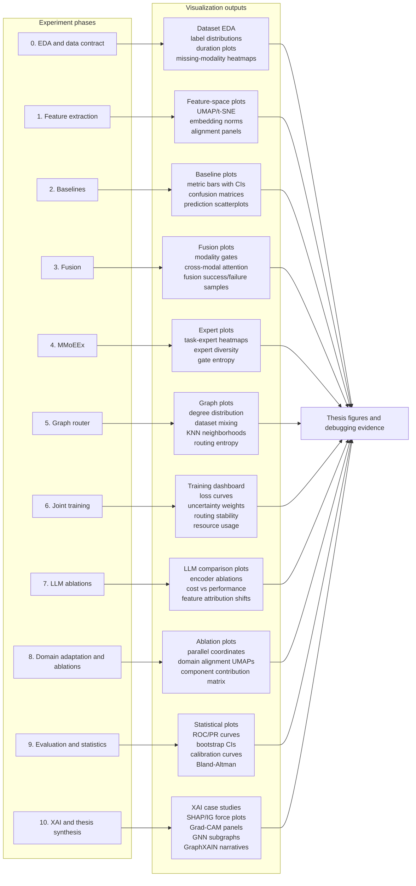

# Updated Architecture Diagrams — Unified Multimodal GG-MoE with LLM and Graph-XAI Extensions

These diagrams update the previous architecture and process flow to reflect the latest implementation plan. The main additions are:

- dataset/sample granularity contract before modeling;
- leakage-safe graph construction with explicit inductive and transductive modes;
- LLM branches for text, audio, and video;
- optional shared multimodal embeddings for graph construction;
- graph routing as both a predictive mechanism and an explainability mechanism;
- visualization checkpoints in every phase, from EDA to graph building, routing, calibration, XAI, and thesis-ready figures.

---

## 1. Unified architecture diagram — latest version

This diagram shows the complete architecture: datasets, sample contract, modality encoders, LLM-enhanced branches, fusion, MMoEEx, graph routing, domain adaptation, task heads, statistical evaluation, and XAI/narrative outputs.

```mermaid
flowchart LR
    %% =====================
    %% Datasets and contract
    %% =====================
    subgraph DataLayer["Datasets and sample contract"]
        DAIC["DAIC-WOZ<br/>session or turn samples<br/>depression + PHQ-8"]
        MOSEI["CMU-MOSEI<br/>utterance samples<br/>sentiment + emotions"]
        FI["ChaLearn FI<br/>clip samples<br/>apparent Big-Five"]
        Contract["Unified sample contract<br/>sample_id + subject_id + dataset_id<br/>task masks + missing-modality masks<br/>official splits + no leakage"]
        DAIC --> Contract
        MOSEI --> Contract
        FI --> Contract
    end

    Contract --> Inputs

    %% =====================
    %% Inputs and encoders
    %% =====================
    subgraph Inputs["Multimodal inputs"]
        TextIn["Text / transcript"]
        AudioIn["Audio waveform / acoustic features"]
        VideoIn["Video frames / facial AUs"]
    end

    subgraph TextBranch["Text branch"]
        TBase["RoBERTa / ClinicalBERT<br/>baseline encoder"]
        TMistral["Mistral-7B-Instruct LoRA<br/>r=16, alpha=32<br/>q_proj + v_proj<br/>LLM text ablation"]
        TTeacher["LLM teacher features<br/>symptom cues, discourse markers,<br/>transcript summaries"]
        TextProj["Text projection<br/>to 256/512-d"]
        TextIn --> TBase
        TextIn --> TMistral
        TextIn --> TTeacher
        TBase --> TextProj
        TMistral --> TextProj
        TTeacher --> TextProj
    end

    subgraph AudioBranch["Audio branch"]
        ABase["Wav2Vec 2.0 / HuBERT / WavLM<br/>speech representation baseline"]
        AHand["eGeMAPS / COVAREP<br/>interpretable acoustic features"]
        ALLM["Audio-LLM ablation<br/>Qwen2-Audio-like features<br/>paralinguistic descriptors"]
        AudioProj["Audio projection<br/>to 256/512-d"]
        AudioIn --> ABase
        AudioIn --> AHand
        AudioIn --> ALLM
        ABase --> AudioProj
        AHand --> AudioProj
        ALLM --> AudioProj
    end

    subgraph VideoBranch["Video branch"]
        VBase["OpenFace AUs<br/>interpretable facial actions"]
        VDeep["ViT / 3D-ResNet<br/>spatiotemporal baseline"]
        VLLM["Vision/Video-LLM ablation<br/>Qwen2.5-VL / LLaVA-OneVision-like features"]
        VideoProj["Video projection<br/>to 256/512-d"]
        VideoIn --> VBase
        VideoIn --> VDeep
        VideoIn --> VLLM
        VBase --> VideoProj
        VDeep --> VideoProj
        VLLM --> VideoProj
    end

    %% =====================
    %% Fusion
    %% =====================
    TextProj --> Fusion
    AudioProj --> Fusion
    VideoProj --> Fusion

    subgraph Fusion["Low-rank / gated late fusion"]
        Masking["Apply modality masks<br/>handle missing text/audio/video"]
        LMF["LMF / gated fusion<br/>+ cross-modal attention"]
        H["Shared fused embedding h_i"]
        Masking --> LMF --> H
    end

    %% =====================
    %% Domain adaptation
    %% =====================
    subgraph DomainAdapt["Domain adaptation ablations"]
        MMD["MMD"]
        CORAL["Deep CORAL"]
        DANN["DANN + GRL"]
        DomainViz["Domain visualizations<br/>UMAP by dataset<br/>alignment curves"]
    end

    H --> MMD
    H --> CORAL
    H --> DANN
    MMD --> H
    CORAL --> H
    DANN --> H
    MMD --> DomainViz
    CORAL --> DomainViz
    DANN --> DomainViz

    %% =====================
    %% MoE backbone
    %% =====================
    subgraph MoE["MMoEEx multitask backbone"]
        Experts["Bank of K experts<br/>MLPs / small transformers"]
        Gates["Task-specific gates<br/>g_t(h_i)"]
        Excl["Expert diversity<br/>exclusivity + orthogonality regularization"]
        H --> Experts
        H --> Gates
        Experts --> Excl
    end

    %% =====================
    %% Graph construction and router
    %% =====================
    subgraph GraphBuild["Graph construction and leakage-safe protocol"]
        HGraph["Graph embeddings<br/>h_i or ImageBind-style shared embeddings"]
        SplitProtocol["Graph protocol<br/>main: inductive val/test<br/>ablation: transductive graph<br/>never use labels in graph edges"]
        KNN["KNN similarity graph<br/>nodes=samples<br/>edges=multimodal similarity"]
        GraphViz["Graph visualizations<br/>degree distribution<br/>dataset mixing<br/>UMAP + neighborhood examples"]
        H --> HGraph
        HGraph --> SplitProtocol --> KNN --> GraphViz
    end

    subgraph Router["Graph-gated MoE router"]
        GraphSAGE["GraphSAGE / GAT router"]
        R["Graph routing weights r_i"]
        RouterEntropy["Router diagnostics<br/>expert usage + entropy"]
        KNN --> GraphSAGE --> R --> RouterEntropy
    end

    %% =====================
    %% Combine routing
    %% =====================
    Gates --> Combine
    Experts --> Combine
    R --> Combine

    Combine["Combine task gate g_t(h_i)<br/>with graph routing r_i<br/>log-space fusion + softmax"]

    Combine --> UDep["u_dep"]
    Combine --> USent["u_sent"]
    Combine --> UEmo["u_emo"]
    Combine --> UPers["u_pers"]

    %% =====================
    %% Task heads
    %% =====================
    subgraph Heads["Task-specific heads"]
        DepHead["DAIC depression head<br/>binary risk + PHQ-8 severity"]
        SentHead["MOSEI sentiment head<br/>regression + optional Acc-2"]
        EmoHead["MOSEI emotion head<br/>multi-label emotions"]
        PersHead["FI personality head<br/>Big-Five regression"]
    end

    UDep --> DepHead
    USent --> SentHead
    UEmo --> EmoHead
    UPers --> PersHead

    %% =====================
    %% Losses and evaluation
    %% =====================
    subgraph TrainEval["Training, calibration, and statistical evaluation"]
        LDep["BCE + optional PHQ loss"]
        LSent["MAE/MSE or CCC loss"]
        LEmo["Multi-label BCE"]
        LPers["MAE / CCC loss"]
        Unc["Homoscedastic uncertainty weighting"]
        TotalLoss["Total loss<br/>task losses + exclusivity + weight decay"]
        Calib["Calibration<br/>Brier + ECE + reliability curves"]
        Stats["Statistical tests<br/>BCa bootstrap CIs<br/>DeLong AUROC<br/>permutation tests"]
        MetricViz["Metric visualizations<br/>bar plots with CIs<br/>parallel coordinates<br/>Bland-Altman plots"]
        DepHead --> LDep --> Unc
        SentHead --> LSent --> Unc
        EmoHead --> LEmo --> Unc
        PersHead --> LPers --> Unc
        Unc --> TotalLoss
        DepHead --> Calib
        EmoHead --> Calib
        DepHead --> Stats
        SentHead --> Stats
        EmoHead --> Stats
        PersHead --> Stats
        Stats --> MetricViz
        Calib --> MetricViz
    end

    %% =====================
    %% XAI
    %% =====================
    subgraph XAI["Explainability and narratives"]
        SHAP["SHAP / Integrated Gradients<br/>modality and feature attribution"]
        GradCAM["Grad-CAM / frame saliency<br/>visual evidence"]
        GNNExp["GNNExplainer / PGExplainer<br/>important nodes, edges, subgraphs"]
        RoutingXAI["Routing explanations<br/>expert weights + graph neighbors"]
        GraphXAIN["GraphXAIN-style LLM narratives<br/>human-readable explanation"]
        XAIViz["XAI visualizations<br/>subgraphs, force plots,<br/>routing heatmaps,<br/>case-study panels"]
        H --> SHAP
        VideoProj --> GradCAM
        GraphSAGE --> GNNExp
        R --> RoutingXAI
        SHAP --> GraphXAIN
        GradCAM --> GraphXAIN
        GNNExp --> GraphXAIN
        RoutingXAI --> GraphXAIN
        GraphXAIN --> XAIViz
    end
```

---

## 2. End-to-end process / flow diagram — latest version

This diagram updates the implementation process so that each phase produces both engineering artifacts and visualization artifacts. This is useful for debugging, thesis explanation, and showing how the model evolves from data exploration to graph construction, training, evaluation, and XAI.

```mermaid
flowchart TD
    Start["Start:<br/>Unified multimodal GG-MoE experiment"] --> P0

    %% =====================
    %% Phase 0
    %% =====================
    P0["Phase 0:<br/>Dataset contract, setup, and EDA"] --> P1
    subgraph P0D["Phase 0 details"]
        P0A["Define sample granularity<br/>DAIC session/turn<br/>MOSEI utterance<br/>FI clip"]
        P0B["Validate splits<br/>subject independence<br/>missing-modality masks<br/>label distributions"]
        P0C["EDA visualizations<br/>class balance<br/>PHQ distribution<br/>sentiment/emotion histograms<br/>Big-Five trait distributions"]
        P0D1["Data-quality visualizations<br/>duration plots<br/>missing modality heatmaps<br/>dataset scale comparison"]
    end

    %% =====================
    %% Phase 1
    %% =====================
    P1["Phase 1:<br/>Preprocessing and feature extraction"] --> P2
    subgraph P1D["Phase 1 details"]
        P1A["Extract baseline features<br/>Wav2Vec/WavLM<br/>OpenFace/ViT<br/>RoBERTa/ClinicalBERT"]
        P1B["Extract LLM features as ablations<br/>Mistral-LoRA text<br/>Audio-LLM features<br/>Vision/Video-LLM features"]
        P1C["Feature visualizations<br/>embedding UMAPs<br/>feature norm distributions<br/>audio/video/text alignment checks"]
        P1D1["Sample-level inspection panels<br/>transcript + waveform summary<br/>key frames + AUs<br/>labels + masks"]
    end

    %% =====================
    %% Phase 2
    %% =====================
    P2["Phase 2:<br/>Unimodal and simple fusion baselines"] --> P3
    subgraph P2D["Phase 2 details"]
        P2A["Train unimodal baselines<br/>text-only<br/>audio-only<br/>video-only"]
        P2B["Train per-dataset late fusion<br/>DAIC, MOSEI, FI"]
        P2C["Baseline visualizations<br/>metric bars with CIs<br/>confusion matrices<br/>prediction-vs-target plots"]
        P2D1["Modality comparison<br/>which modality works best<br/>per dataset and task"]
    end

    %% =====================
    %% Phase 3
    %% =====================
    P3["Phase 3:<br/>Fusion and shared representation"] --> P4
    subgraph P3D["Phase 3 details"]
        P3A["Implement LMF / gated fusion<br/>with missing-modality masks"]
        P3B["Train fusion-only models<br/>before MoE and graph routing"]
        P3C["Fusion visualizations<br/>modality gate weights<br/>attention heatmaps<br/>fused embedding UMAP"]
        P3D1["Failure analysis<br/>samples where fusion helps or hurts"]
    end

    %% =====================
    %% Phase 4
    %% =====================
    P4["Phase 4:<br/>MMoEEx multitask backbone without graph"] --> P5
    subgraph P4D["Phase 4 details"]
        P4A["Add K experts<br/>task-specific gates<br/>exclusivity regularizer"]
        P4B["Train per-dataset and joint multitask variants<br/>without graph"]
        P4C["Expert visualizations<br/>task-by-expert heatmaps<br/>expert diversity plots<br/>gate entropy curves"]
        P4D1["Training visualizations<br/>loss curves<br/>learned uncertainty weights<br/>negative transfer diagnostics"]
    end

    %% =====================
    %% Phase 5
    %% =====================
    P5["Phase 5:<br/>Graph construction and GG-MoE router"] --> P6
    subgraph P5D["Phase 5 details"]
        P5A["Build KNN graphs<br/>from h_i and optionally<br/>ImageBind-style embeddings"]
        P5B["Use leakage-safe graph protocol<br/>main: inductive<br/>secondary: transductive ablation"]
        P5C["Train GraphSAGE/GAT router<br/>produce r_i over experts"]
        P5D1["Graph visualizations<br/>KNN examples<br/>degree distribution<br/>dataset mixing matrix<br/>subgraph samples"]
        P5E["Router visualizations<br/>routing entropy<br/>expert usage<br/>graph-vs-gate contribution"]
    end

    %% =====================
    %% Phase 6
    %% =====================
    P6["Phase 6:<br/>Joint multimodal multitask GG-MoE training"] --> P7
    subgraph P6D["Phase 6 details"]
        P6A["Mixed DAIC/MOSEI/FI batches<br/>task masks and dataset balancing"]
        P6B["Forward path<br/>encoders -> fusion -> experts -> graph router -> heads"]
        P6C["Periodic embedding refresh<br/>and optional graph rebuild"]
        P6D1["Training dashboards<br/>per-task losses<br/>uncertainty weights<br/>routing entropy<br/>GPU/memory usage"]
    end

    %% =====================
    %% Phase 7
    %% =====================
    P7["Phase 7:<br/>LLM-enhanced ablations"] --> P8
    subgraph P7D["Phase 7 details"]
        P7A["Text LLM ablation<br/>Mistral-LoRA vs RoBERTa/ClinicalBERT"]
        P7B["Audio LLM ablation<br/>audio-language descriptors or embeddings"]
        P7C["Video LLM ablation<br/>vision/video-language embeddings"]
        P7D1["Shared embedding ablation<br/>ImageBind-style graph embeddings"]
        P7E["LLM visualizations<br/>feature attribution comparison<br/>embedding separability<br/>cost/performance plots"]
    end

    %% =====================
    %% Phase 8
    %% =====================
    P8["Phase 8:<br/>Domain adaptation and ablation grid"] --> P9
    subgraph P8D["Phase 8 details"]
        P8A["Add MMD, CORAL, and DANN<br/>on shared representation h_i"]
        P8B["Run FI->DAIC and MOSEI->DAIC<br/>adaptation experiments"]
        P8C["Core ablations<br/>no graph<br/>no multitask<br/>no LLM<br/>modality drops<br/>no domain adaptation"]
        P8D1["Ablation visualizations<br/>parallel coordinates<br/>critical-difference plots<br/>domain alignment UMAPs"]
    end

    %% =====================
    %% Phase 9
    %% =====================
    P9["Phase 9:<br/>Evaluation, calibration, and statistics"] --> P10
    subgraph P9D["Phase 9 details"]
        P9A["Metrics<br/>DAIC: AUROC, AUPRC, F1, sensitivity, specificity<br/>MOSEI: MAE, F1, AUROC<br/>FI: CCC, MAE"]
        P9B["Calibration<br/>Brier score<br/>ECE<br/>reliability curves"]
        P9C["Statistical testing<br/>BCa bootstrap CIs<br/>DeLong AUROC<br/>permutation tests<br/>effect sizes"]
        P9D1["Evaluation visualizations<br/>bar charts with CIs<br/>ROC/PR curves<br/>Bland-Altman plots<br/>calibration plots"]
    end

    %% =====================
    %% Phase 10
    %% =====================
    P10["Phase 10:<br/>XAI, narrative explanations, and thesis figures"] --> End
    subgraph P10D["Phase 10 details"]
        P10A["SHAP / Integrated Gradients<br/>feature and modality attribution"]
        P10B["Grad-CAM / frame saliency<br/>for visual branch"]
        P10C["GNNExplainer / PGExplainer<br/>subgraph explanations"]
        P10D1["GraphXAIN-style LLM narratives<br/>convert technical explanations<br/>into readable case narratives"]
        P10E["Final visual assets<br/>case-study panels<br/>subgraphs<br/>routing heatmaps<br/>failure-mode gallery"]
    end

    End["End:<br/>Thesis-ready experiment chapter<br/>methods, results, visualizations, XAI, discussion"]
```

---

## 3. Visualization and explainability map by phase

This diagram makes the visualization strategy explicit. Each phase produces specific figures so the experiment can be debugged, explained, and defended in the thesis.

---

## Notes for thesis usage

- Use the first diagram in the **methodology / architecture** section.
- Use the second diagram in the **implementation plan / experimental protocol** section.
- Use the third diagram in the **visual analytics / XAI / reporting strategy** section.
- Keep the graph protocol explicit in the text: the main reported model should use inductive validation/test graph construction, while transductive graph construction should be reported only as a secondary ablation.
- Keep the LLM components modular: Mistral-LoRA, audio LLMs, and vision/video LLMs should be ablation branches or teacher/explanation modules before being treated as core predictive components.
