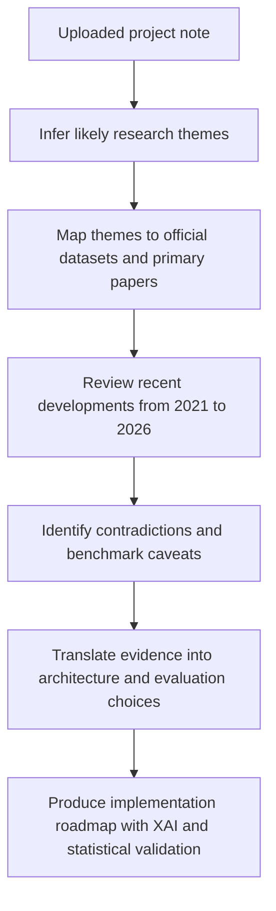
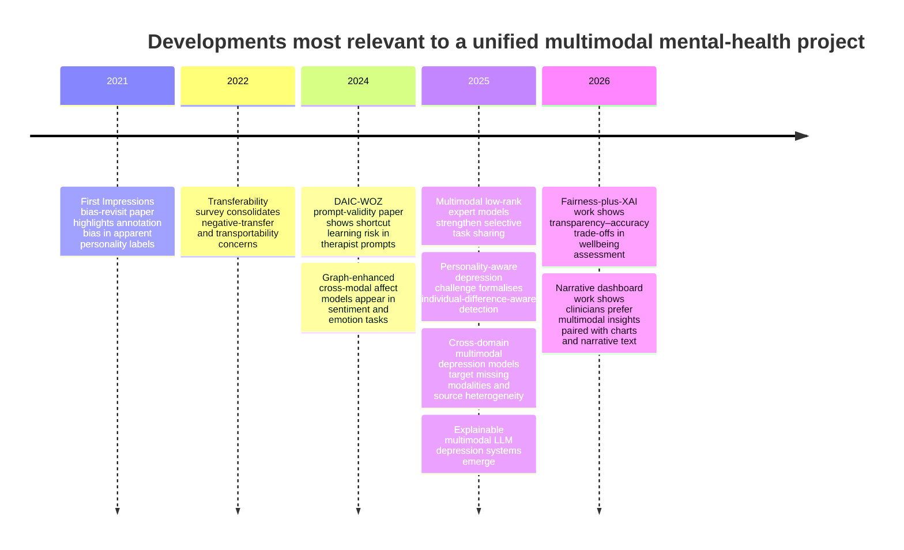

# Deep Research Report on the Likely Topics Implied by the Uploaded Project Note

## Executive summary

The uploaded project note asks for a **unified multimodal, multitask research programme** that combines depression assessment, sentiment and emotion analysis, personality prediction, graph-based modelling, explainability, strong statistics, and persuasive visual outputs. In practical terms, the most plausible implied research agenda is: **build one shared architecture that learns from DAIC-WOZ for depression-related assessment, CMU-MOSEI for sentiment and emotion, and a multimodal personality benchmark most likely represented by ChaLearn First Impressions V2; then validate it with ablations, significance testing, calibration, and XAI-oriented visualisations.** fileciteturn0file0 citeturn6view0turn44view0turn18view0turn19view1turn6view2

The strongest high-confidence conclusion from current sources is that this project is **research-feasible but scientifically delicate**. It is feasible because all three benchmark families are established, public or controlled-access, multimodal, and widely used for representation learning. It is delicate because the three tasks do **not** measure the same construct: DAIC-WOZ is grounded in clinical interview screening and PHQ-8 labels, CMU-MOSEI measures public expressed sentiment and six emotions, and First Impressions V2 measures **apparent** personality from crowd judgements rather than ground-truth clinical personality. A single model can therefore be justified as a **shared representation learning** system, but not as evidence that sentiment, emotion, personality and depression are interchangeable labels. citeturn44view0turn19view1turn6view2turn42view0turn46academia2turn46academia3

Recent work strengthens that conclusion. On the positive side, recent papers report gains from tri-modal fusion, speech-aware retrieval, graph-enhanced affect models, low-rank or gated expert sharing, cross-domain multimodal depression models, and explainable multimodal LLM-style systems. On the cautionary side, recent evidence also shows dataset shortcut risks in DAIC-WOZ, grounding problems in apparent-personality labels, asymmetric negative transfer in multitask learning, and fairness–accuracy trade-offs in wellbeing assessment. The safest interpretation is that the best project design is **hierarchical multimodal encoding + task-specific heads + controlled sharing + graph/XAI as optional, testable modules**, not one monolithic “all-in-one” classifier. citeturn20academia4turn43academia2turn43academia1turn21academia0turn21academia1turn52academia1turn52academia3turn51academia0turn41academia0turn41academia3

The most important practical implication is that **evaluation discipline will matter more than architecture novelty**. The FDA-authored statistical review emphasises representative training data, truly external validation, repeatability and reproducibility, calibration, hypothesis-testing-backed acceptance criteria, and comparator studies on the same patients or cases. For this project, that means subject-independent splits, dataset-specific held-out tests, subgroup reporting, confidence intervals, paired statistical tests, and careful language around what each auxiliary task is actually teaching the model. citeturn54view0turn27view1

## Assumptions and inferred topic set

I am assuming the uploaded note is the “prior brief exchange” from which the research topics must be inferred. On that basis, the most plausible intended topics are shown below. The note explicitly asks for a unified architecture spanning DAIC, personality, emotion, sentiment, graph components, explainability, better visualisation, and statistical comparison with prior architectures. fileciteturn0file0

| Inferred topic | Why it is strongly implied | Best-fit primary sources and datasets | Main ambiguity to keep in view |
|---|---|---|---|
| Unified multimodal benchmark design | The note asks to train and validate one architecture across DAIC, personality, emotion and sentiment. fileciteturn0file0 | DAIC-WOZ official site and documentation; CMU-MOSEI ACL paper and audEERING dataset page; ChaLearn First Impressions V2 official page. citeturn6view0turn44view0turn18view0turn19view1turn16view0turn6view2 | The intended personality dataset is not named explicitly. |
| Multimodal fusion plus multitask learning | The note asks for “grounded on multimodal fusion and multitasking”. fileciteturn0file0 | Fusion and multitask papers on DAIC-WOZ, CMU-MOSEI, MMoE-style learning, uncertainty weighting. citeturn43academia2turn20academia2turn21academia0turn40academia2 | Whether the user wants a classical deep model or a foundation-model wrapper is unclear. |
| Graph components, routing and explainability | The note asks for graph components that demonstrate XAI. fileciteturn0file0 | GNNExplainer, GraphXAIN, graph-enhanced sentiment models, personality-guided hypergraph depression models. citeturn34academia1turn34academia2turn21academia1turn52academia2 | The graph may be intended either as a routing mechanism, an instance graph, or only as a visual explanation layer. |
| Statistical evaluation, visualisation and comparison with prior models | The note asks for hypothesis testing, comparative analysis, radar-like visualisation, and explainable graphs. fileciteturn0file0 | FDA statistical validation paper; FDA GMLP page; graphical-perception literature; MIND dashboard paper. citeturn54view0turn27view1turn38academia0turn58view0 | The intended end use may be a thesis prototype rather than a deployable clinical device. |

The research synthesis below follows a conservative method: infer topics from the note, ground each in official dataset documentation and primary papers, add the most relevant recent developments from the last five years, then derive implementation implications only where the evidence supports them. fileciteturn0file0 citeturn6view0turn44view0turn18view0turn6view2turn54view0

## Benchmark landscape and task alignment

**Executive summary for this topic:** the benchmark combination is intellectually coherent for **shared multimodal representation learning**, but not for a single undifferentiated clinical label space. DAIC-WOZ provides clinical-style interview data and PHQ-8-related depression labels; CMU-MOSEI provides large-scale naturalistic affect data with sentiment and emotion labels; First Impressions V2 provides crowd-scored apparent personality from short English-speaking videos. The benefits are complementary modalities, label diversity and richer auxiliary supervision. The core risk is construct mismatch. citeturn44view0turn19view1turn6view2turn42view0turn46academia3

DAIC-WOZ officially contains **189 sessions** ranging from roughly **7 to 33 minutes**, with an average of about **16 minutes**, and includes transcripts, participant audio, facial features, questionnaire fields, PHQ-8-based binary labels and split files. The documentation also shows the practical file structure most relevant for implementation: audio waveform, transcript, CLNF/OpenFace-derived facial files, and COVAREP/Formant acoustic feature files. That makes DAIC-WOZ especially suitable for a multimodal depression head with reproducible preprocessing. citeturn6view0turn44view0

CMU-MOSEI, by contrast, is a much larger affect benchmark. The ACL paper reports **23,453 sentences**, **3,228 videos**, **1,000 distinct speakers**, and **250 topics**; annotations include sentiment on a **[-3, +3]** scale and six Ekman emotions on **[0, 3]** intensity scales. The dataset paper also highlights aligned language, acoustic and visual streams, which is exactly why CMU-MOSEI is so useful as an auxiliary task source for learning richer multimodal affective representations. citeturn18view0turn19view1turn16view0

ChaLearn First Impressions V2 is the clearest default assumption for the missing “personality dataset” in the note. Its official page states that it comprises **10,000 clips**, each around **15 seconds**, extracted from **more than 3,000** English-speaking YouTube videos, with labels for the **Big Five** personality traits scaled to **[0,1]**. But those labels are not clinical personality diagnoses or self-reports; they are **perceived/apparent personality judgements** generated by crowdworkers. That distinction is not minor; it affects what claims your final thesis can responsibly make. citeturn6view2turn42view0turn46academia2turn46academia3

The two charts below show why this benchmark trio is attractive and also why it must be handled carefully. The first compares the scale of labelled units in **non-comparable units** (sessions, sentences, clips). The second compares approximate total media duration, using the official average or total durations reported on the dataset pages. Together they show a major imbalance in supervision density: MOSEI is far denser at the utterance level, while DAIC-WOZ has much fewer but much longer and more structured interviews. citeturn6view0turn44view0turn16view0turn19view1turn6view2

| Dataset | Labelled unit | Core labels | Modalities readily available | Best use in a unified project | Primary caveat |
|---|---|---|---|---|---|
| DAIC-WOZ | Interview session | PHQ-8 score and binary thresholding support | Text, audio, facial features, questionnaire fields | Main mental-health assessment head | Shortcut risk from interviewer prompts; comparatively small sample size. citeturn20academia4turn44view0 |
| CMU-MOSEI | Sentence / utterance | Continuous sentiment and six emotion intensities | Text, audio, video | Auxiliary affect supervision and robust multimodal encoder pretraining | Public opinion/speech affect is not equivalent to clinical symptom expression. citeturn19view1turn39academia1 |
| First Impressions V2 | Short clip | Big Five **apparent** personality | Video, audio, sometimes transcriptable speech | Auxiliary individual-difference supervision | Crowd-perceived personality is subjective and bias-prone. citeturn6view2turn42view0turn46academia0turn46academia2 |

**Recent developments over the last five years:** the most relevant change is not just model complexity but **personalisation and transfer-awareness**. In 2025, the MPDD challenge explicitly framed depression detection as **personality-aware**, signalling growing interest in individual-difference-aware depression modelling. In parallel, recent cross-domain depression work argues that stable multimodal depression recognition needs explicit handling of heterogeneous sources and missing modalities. These are closely aligned with the project note’s ambition to unify depression, personality and affective signals. citeturn57academia2turn52academia1

**Major debate / contradiction:** whether auxiliary task gains are genuine or artefactual. For DAIC-WOZ, the 2024 prompt-validity paper shows that high performance can be driven by shortcuts in therapist prompts rather than better modelling of patient state. For First Impressions V2, bias studies show that age, gender, ethnicity and attractiveness influence labels, and that converting pairwise impressions into continuous scores can magnify bias. Those two critiques together mean that a stronger-looking unified model can still learn the wrong thing. citeturn20academia4turn42view0turn46academia0turn46academia2

**Practical implication:** a good unified benchmark strategy is to treat depression as the **primary clinical task**, and treat sentiment, emotion and apparent personality as **auxiliary supervisory signals** that may improve representation learning. A weaker and riskier strategy would be to collapse them into a single jointly interpreted psychological latent space without strong theoretical justification. citeturn44view0turn19view1turn6view2turn46academia3turn41academia3

**Suggested follow-up research:** add at least one study that checks whether personality supervision improves depression assessment **only on external or cross-domain validation**, not just on in-domain test splits; and add one study that compares apparent-personality supervision against a cleaner individual-difference proxy, if such a dataset is available to you. citeturn52academia1turn57academia2turn46academia3

## Unified multimodal fusion and multitask architecture

**Executive summary for this topic:** the best-supported design is a **shared multimodal backbone with carefully limited sharing**, not naïve hard parameter sharing. Current evidence favours modality-specific encoders, a hierarchical or late fusion layer, task-specific heads, and some mechanism to reduce task conflict such as uncertainty weighting, mixture-of-experts, or routing conditioned on task/domain. citeturn21academia0turn40academia2turn41academia0turn41academia3

Recent multimodal sentiment work continues to show that text remains especially influential, but the survey literature stresses that audio and visual channels still carry essential contextual and affective signals. That matters for your project because DAIC-WOZ and MOSEI are both speech-and-expression heavy, while the uploaded note specifically asks for multimodal fusion rather than text-only modelling. The safest design choice is therefore **modality-specific encoders first, fusion later**, so that missing or weak modalities do not collapse the shared representation. citeturn39academia1turn19view1turn44view0

On the depression side, the recent literature shows an unmistakable drift toward stronger multimodal fusion and LLM-assisted pipelines. A 2024 tri-modal DAIC-WOZ paper reports gains from MFCCs, facial action units and GPT-4-processed text. A 2025 teacher–student fusion paper reports very high scores on DAIC-WOZ using text and audio with adaptive weighting. A 2025 speech-timing RAG paper argues that text-only retrieval is insufficient because depression-relevant information is heavily encoded in timing and prosody rather than lexical content alone. These results collectively support multimodality, but the headline scores should be treated carefully because recent DAIC-WOZ work has also exposed shortcut risks and validation fragility. citeturn43academia2turn20academia2turn43academia1turn20academia4

For multitask sharing, the strongest current fit to your use case is the **expert-based family** rather than uniform sharing. The 2025 MMoLRE paper shows that multimodal sentiment analysis and emotion recognition benefit from shared and task-specific experts because hard parameter sharing can create parameter conflicts. Recent work on uncertainty-based loss weighting continues to reinforce the value of principled balancing between heterogeneous objectives, especially when regression and classification tasks coexist. Meanwhile, recent multitask-transfer literature warns that asymmetric transfer is common: one task can help another while being harmed in return. That is exactly the situation you should expect when combining depression, sentiment, emotion and apparent personality. citeturn21academia0turn40academia0turn40academia2turn41academia0turn41academia3

The most relevant recent architecture trends for your exact thesis-like idea are these: the **personality-aware depression challenge** in 2025, the **cross-domain missing-modality depression framework** in late 2025, and the **personality-guided hypergraph depression model** in late 2025. These do not prove that personality supervision will always help depression detection, but they do show that the field is moving toward **individual-difference-aware**, **heterogeneous-data-aware**, and **explainability-aware** multimodal systems. Your project is therefore well aligned with the frontier, provided that it evaluates whether the added complexity truly generalises. citeturn57academia2turn52academia1turn52academia2

| Architectural option | What current evidence suggests | Strength in your project | Main risk | Recommendation |
|---|---|---|---|---|
| Simple hard parameter sharing | Can work, but often hides task conflict in heterogeneous tasks. citeturn21academia0turn41academia0 | Easy to implement | Negative transfer and domination by the largest benchmark | Use only as a baseline |
| Hierarchical / late multimodal fusion | Consistent with multimodal benchmark structure and robust modality handling. citeturn39academia1turn43academia2turn44view0 | Strong interpretability and missing-modality tolerance | May miss fine-grained token-level interactions | Use as the default backbone |
| Mixture-of-experts or shared-plus-private experts | Strong fit when tasks overlap partially but not completely. citeturn21academia0turn41academia0 | Lets sentiment, emotion, personality and depression share selectively | More tuning, expert collapse, weak load balancing | Use as the main multitask mechanism |
| Uncertainty-weighted multitask loss | Well suited to mixed regression/classification heads. citeturn40academia2turn40academia0 | Stabilises joint training | Weights can still mask poor task definitions | Use in the main model and report learned weights |
| Multimodal-LLM wrapper | Powerful for prompting, rationale generation and flexible interfaces. citeturn52academia3turn51academia0 | Helpful for explanation and clinician-facing output | Expensive, less reproducible, hard to validate clinically | Use as an ablation or explanation layer, not as the only core model |

**Practical implication:** if the project’s goal is a rigorous research contribution, the strongest unified model should probably look like this in prose: **dataset-specific preprocessing → shared text/audio/video encoders → hierarchical fusion → shared-plus-private experts → separate heads for depression, sentiment, six emotions, and Big Five apparent personality → optional graph router and optional explanation generator**. That architecture matches the state of the art far better than a single fused embedding feeding every task equally. citeturn21academia0turn52academia1turn52academia2turn52academia3turn40academia2

**Suggested follow-up research:** run one ablation that removes personality entirely, one that removes graph routing, and one that replaces MMoE-style sharing with plain late fusion. If the unified model only wins with personality-aware or graph-aware additions on in-domain tests but loses on external validation, the stronger scientific conclusion may be that those additions improve benchmark fit rather than robust mental-health assessment. citeturn52academia1turn57academia2turn54view0

## Graph components, explainability and visual outputs

**Executive summary for this topic:** graph components make the most sense here as **structure-aware routing and explanation tools**, not as the only backbone. The most defensible XAI stack is multi-layered: **feature attribution** for modalities, **saliency/localisation** for video frames, and **subgraph explanations** when graph routing is used. citeturn34academia1turn34academia2turn34academia0turn36academia0

For graph explainability, the strongest primary methods remain GNNExplainer for compact subgraph and feature subset discovery, and more recently GraphXAIN for turning graph explanations into more understandable natural-language narratives. For non-graph parts of the model, SHAP remains a strong tool for global and local feature attribution, while Integrated Gradients provides an axiomatic attribution method that is particularly useful for neural text/audio/video encoders. If a visual backbone is retained, Grad-CAM-style maps remain a reasonable way to show which regions of a frame contributed to a decision. citeturn34academia1turn34academia2turn34academia0turn36academia0turn35academia0

Recent work shows that these layers can be meaningfully combined in mental-health-adjacent systems. The 2024 graph-enhanced cross-modal infusion paper uses graph aggregation to recalibrate multimodal sentiment and emotion features. The 2025 personality-guided hypergraph depression paper uses higher-order graph structure to model individual differences in depression recognition. The 2025 explainable multimodal LLM depression paper explicitly frames explanation as a missing piece in depression assessment models. And the 2026 FAIR_XAI work shows that explainability techniques can expose fairness problems, although its results also show that improving fairness through prompting or explanation-aware intervention can sharply reduce accuracy. That is a crucial warning: **explanation helps diagnosis of model behaviour, but does not automatically solve bias or validity problems**. citeturn21academia1turn52academia2turn52academia3turn51academia0

The timeline below summarises the most relevant developments shaping the implied project during the last five years. It combines dataset critique, transfer-learning caution, graph/XAI advances, and recent multimodal mental-health directions. citeturn46academia0turn41academia3turn21academia1turn20academia4turn21academia0turn52academia1turn51academia0

For visualisation, the uploaded note asks specifically about radar plots and graph-based XAI. The evidence supports a **mixed strategy**. Use radar-like plots only as a **secondary overview** for a small number of normalised metrics and a small number of models. For precise comparison, graphical-perception research still favours position on a common scale over angle- or area-heavy encodings, so the main thesis figures should be grouped bar charts, dot plots, calibration plots, ROC/PR curves, Bland–Altman or scatter plots for regression-style outputs, and heatmaps for expert routing or attribution. The 2026 MIND dashboard paper is especially relevant here because it found that clinicians preferred multimodal insights presented through **narrative text plus charts**, not through a single flashy summary visual. fileciteturn0file0 citeturn38academia0turn54view0turn58view0

A good XAI visual package for this project would therefore include: one **expert-routing heatmap** by task and dataset; one **SHAP beeswarm** for each main head; one **Integrated Gradients or Grad-CAM qualitative panel** for text/audio/video examples; one **subgraph explanation** for graph-routed cases; and one **fairness or subgroup performance plot** to show whether explanation aligns with equitable performance. That package would answer more questions, and more honestly, than a thesis that relies mostly on radar charts. citeturn34academia0turn36academia0turn34academia1turn35academia0turn51academia0

**Suggested follow-up research:** compare “technical explanation only” against “technical explanation plus narrative explanation” for human understanding, borrowing directly from GraphXAIN and MIND. That would let the project contribute not just model performance, but also evidence about how explainability should be communicated to non-ML readers. citeturn34academia2turn58view0

## Evaluation, statistics, governance and practical implications

**Executive summary for this topic:** the credibility of the project will rise or fall on whether it treats evaluation as a first-class scientific object. Current FDA-linked statistical guidance is clear that internal validation is only a starting point, external validation is essential, training and validation data must reflect intended use while minimising overlap, and performance claims should be accompanied by confidence intervals and appropriate hypothesis tests. citeturn54view0

The FDA-authored statistical review is unusually relevant to your note because it directly addresses **AI/ML-enabled diagnostic validation**. It identifies four core validation aspects: quality of training data, quality of validation data, precision through repeatability and reproducibility, and model accuracy. It explicitly warns that randomly splitting one procured database can overestimate performance, recommends external validation on independent test data, emphasises subgroup analysis for representativeness and bias checking, and recommends calibration plots, ROC analysis, decision-curve-style evaluation and confidence-interval-backed acceptance criteria depending on output type. In other words, the right evaluation design here is not optional window dressing; it is the scientific backbone of the whole project. citeturn54view0

For this specific benchmark combination, the most important statistical and design consequences are straightforward. First, keep **dataset-specific official test splits** intact wherever possible. Second, do not let DAIC interview prompt artefacts contaminate causal claims about depression recognition. Third, report both **task-wise** and **subgroup-wise** performance. Fourth, compare models on the same held-out cases, then use confidence intervals and paired tests rather than one-off point estimates. Fifth, because you are mixing clinical and non-clinical tasks, report a clear hierarchy of claims: primary claims about depression detection, secondary claims about representational benefit from affect and personality auxiliaries. citeturn20academia4turn44view0turn54view0turn46academia3

The governance signal is also telling. FDA’s current GMLP page notes that in **January 2025** the IMDRF released a final document with **10 guiding principles** for Good Machine Learning Practice, building on the principles first released in 2021. FDA’s public AI-enabled medical-device page also states that the agency intends to improve transparency around devices using foundation models and LLM-like functionality. At the same time, the public device list is dominated by radiology, cardiovascular and neurology products; simple keyword search on the page did not return “mental”, “depression” or “anxiety”, and FDA explicitly says the list is **not comprehensive**. The practical reading is that multimodal mental-health models remain much less mature in formal regulatory pathways than imaging AI. citeturn27view1turn28view0turn29view1turn29view2turn29view3

| Evaluation dimension | High-confidence recommendation | Why it matters here |
|---|---|---|
| Split design | Preserve official splits; keep subject independence; add external or cross-dataset stress tests where possible. citeturn44view0turn54view0 | Prevents inflated performance and transportability illusions. |
| Metrics | Depression: AUROC, AUPRC, F1, sensitivity, specificity, calibration. Sentiment/emotion/personality: MAE or CCC plus task-appropriate classification metrics. citeturn54view0turn19view1turn6view2 | Mixed tasks require mixed metrics and explicit calibration. |
| Statistical inference | Report 95% confidence intervals; use paired comparisons on the same held-out cases; add bootstrap-based uncertainty reporting for small gains. citeturn54view0turn31academia3 | Prevents over-claiming tiny benchmark differences. |
| Bias analysis | Stratify by demographics and recording conditions where labels exist; inspect label bias in apparent personality and prompt bias in DAIC. citeturn20academia4turn42view0turn46academia0 | Your auxiliary tasks carry known biases that can bleed into depression predictions. |
| Reporting language | Call depression the primary task; call personality/sentiment/emotion auxiliary or related tasks. fileciteturn0file0 citeturn46academia3 | Protects the thesis from construct overreach. |

**Practical implication:** if the project aims to be thesis-grade rather than merely benchmark-grade, it should include at least one result section whose main contribution is **methodological honesty**: calibration, subgroup stability, external validation, and failure analysis. That section may end up being more publishable than another small gain in F1. citeturn54view0turn51academia0

**Suggested follow-up research:** add a deployment-readiness appendix aligned to GMLP-style principles, covering data provenance, bias checks, intended use, model locking, change control, and post-deployment monitoring plans—even if no deployment is planned yet. That will make the work stronger and more contemporary. citeturn27view1turn28view0

## Integrated implementation roadmap

The strongest synthesis of the evidence is a **research roadmap with staged ambition**. Start by building a defensible benchmark and only then add graph routing, personality-aware transfer, or LLM-style explanations. That sequence matches both current science and current governance expectations. citeturn54view0turn21academia0turn52academia1turn52academia3

| Workstream | Recommended implementation choice | Why this is the best evidence-based choice | Minimum success criterion |
|---|---|---|---|
| Data harmonisation | Use dataset-specific preprocessing, keep original label spaces intact, and add a dataset/domain token to all samples. citeturn44view0turn19view1turn6view2 | The benchmarks differ in unit, duration, label meaning and likely annotation noise. | Clean, reproducible loaders and no leakage across train/dev/test. |
| Backbone encoders | Separate text, audio and video encoders before fusion. citeturn39academia1turn43academia2 | Prevents any one modality from collapsing the shared space and supports missing-modal ablations. | Strong unimodal baselines and stable multimodal fusion training. |
| Fusion | Hierarchical or late fusion as the default baseline. citeturn39academia1turn44view0 | More robust and easier to interpret than end-to-end opaque fusion from the outset. | Beats or matches unimodal baselines on each dataset. |
| Multitask sharing | Shared-plus-private experts with uncertainty-weighted loss. citeturn21academia0turn40academia2 | Best fit for partially related but non-identical tasks. | Beats hard-sharing baseline without hurting main depression task. |
| Graph module | Add graph routing only after the non-graph model is stable; use it as an ablation-tested extension. citeturn21academia1turn34academia1 | Graph complexity is justifiable only if it improves generalisation or explanation quality. | Demonstrable gain in external validation or explainability, not only in in-domain metrics. |
| XAI layer | Combine SHAP, Integrated Gradients, Grad-CAM-style maps, and subgraph explanations; optionally add narrative explanations. citeturn34academia0turn36academia0turn35academia0turn34academia2turn58view0 | No single explanation method covers all modalities or user needs. | Produces consistent global and local explanations across tasks. |
| Evaluation | External validation emphasis, subgroup analysis, calibration, confidence intervals, and paired tests. citeturn54view0 | This is the clearest gap between impressive demos and credible medical-AI research. | Final claims survive statistical comparison and failure analysis. |

If this roadmap is followed, the project’s central scientific claim can be stated cautiously but powerfully: **a unified multimodal architecture can improve representation learning for mental-health-adjacent tasks when auxiliary supervision is carefully separated, task conflicts are actively managed, and evaluation avoids leakage and construct overreach.** That is a defensible thesis contribution. The stronger but riskier claim—that one unified model inherently proves a common latent structure across depression, personality, emotion and sentiment—would not be well supported by the present evidence base. citeturn41academia3turn20academia4turn46academia3turn54view0

## Open questions and clarifying points

The biggest unresolved ambiguity is the intended **personality benchmark**. I assumed **ChaLearn First Impressions V2** because it is the closest public multimodal English benchmark matching the note, but if you meant a different personality dataset, the recommendation set changes. fileciteturn0file0 citeturn6view2

Three clarifying questions would materially sharpen the next iteration of this research plan. Is the personality task meant to be **apparent personality** or **self-reported personality**? Is the main depression outcome meant to be **binary screening**, **PHQ-8 regression**, or both? And is the real target a **thesis benchmark contribution** or a **clinically translational prototype**? Those choices affect dataset selection, evaluation criteria, explanation style, and how ambitious the final claims should be. fileciteturn0file0 citeturn44view0turn46academia3turn54view0

The most important limitation of this report is that it had to infer topics from an ambiguous note rather than from an explicit task list. For that reason, I ranked recommendations by confidence and avoided pretending that all auxiliary tasks carry the same scientific meaning. Where recent findings came primarily from preprints rather than long-established peer-reviewed sources, I treated them as **directional signals**, not settled facts. fileciteturn0file0 citeturn52academia1turn52academia3turn51academia0