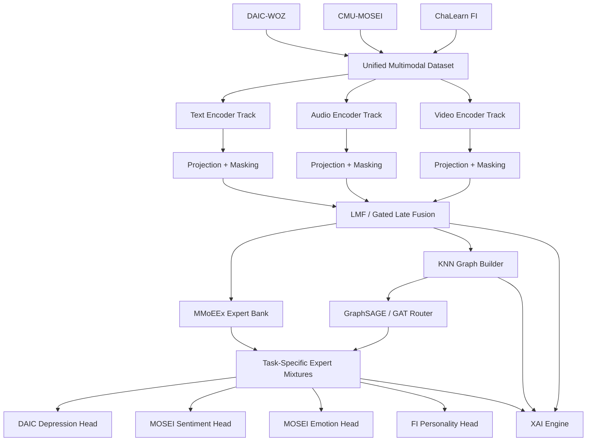

# Improved Final Implementation Plan — Unified Multimodal Graph-Gated MoE Experiment

**Project context:** Experiment 5 / Chapter 8 unified model for multimodal mental-health-related representation learning.  
**Main goal:** Build and evaluate a unified multimodal, multitask architecture that learns from DAIC-WOZ, CMU-MOSEI, and ChaLearn First Impressions, while testing whether controlled sharing, graph-based routing, multimodal LLM features, and graph-based XAI improve performance, calibration, robustness, and interpretability.

---

## 0. Executive summary

This improved plan replaces the earlier `final-impl-plan.md` with a more execution-ready roadmap. The previous plan already defined the right strategic direction: DAIC-WOZ for depression, CMU-MOSEI for sentiment and emotion, ChaLearn First Impressions for apparent personality, late/LMF-style multimodal fusion, MMoEEx, GraphSAGE/GAT routing, uncertainty-weighted multitask learning, calibration, statistical tests, and XAI.

The main improvements in this version are:

1. A formal **dataset/sample granularity contract** so DAIC session-level labels, MOSEI utterance-level labels, and FI clip-level labels are not mixed naively.
2. A stricter **leakage-safe graph protocol** distinguishing inductive graph evaluation from transductive graph ablations.
3. A first-class **visualization plan for every phase**, starting with dataset EDA and continuing through graph construction, routing diagnostics, training dynamics, ablations, calibration, and XAI.
4. An explicit **LLM extension track** covering text LLMs, audio LLMs, vision/video LLMs, multimodal embedding models, teacher features, and GraphXAIN-style narratives.
5. A clearer **acceptance criteria matrix** so each phase has measurable pass/fail conditions.
6. A stronger **ablation and statistical testing matrix** so the thesis can prove which components help and which only add complexity.

The central research claim should be conservative and defensible:

> We are not claiming that depression, sentiment, emotion, and personality are the same construct. We are testing whether a unified multimodal architecture can learn shared and task-specific representations across related affective and behavioral signals, and whether graph-based routing plus XAI improves model understanding, robustness, and explainability.

---

## 1. Research objectives and core questions

### 1.1 Main objective

Implement one modular architecture that supports:

- **DAIC-WOZ:** depression classification and optionally PHQ-8 severity regression.
- **CMU-MOSEI:** sentiment regression / classification and multi-label emotion classification.
- **ChaLearn FI:** Big-Five apparent personality regression.

The architecture should combine:

- modality-specific encoders;
- late / low-rank multimodal fusion;
- MMoEEx-style expert sharing;
- GraphSAGE/GAT-based graph-gated routing;
- uncertainty-weighted multitask loss;
- optional LLM-based modality encoders and teacher features;
- statistical validation;
- graph-based and feature-based XAI.

### 1.2 Main research questions

**RQ1 — Multimodal fusion:**  
Does late/LMF-style multimodal fusion improve over unimodal text, audio, and visual baselines for each dataset?

**RQ2 — Multitask learning:**  
Does MMoEEx-style controlled sharing improve over hard parameter sharing and per-dataset isolated models?

**RQ3 — Graph routing:**  
Does a KNN graph + GraphSAGE/GAT router improve performance, calibration, or expert specialization compared with non-graph MMoEEx?

**RQ4 — LLM-enhanced modalities:**  
Do LLM-derived text, audio, and video features improve the unified model compared with classical encoders such as RoBERTa, Wav2Vec/WavLM, OpenFace, ViT, and 3D-ResNet?

**RQ5 — Explainability:**  
Can graph-based explanations reveal which similar samples, modalities, and experts influenced a prediction in a way that is clearer than feature attribution alone?

**RQ6 — Statistical validity:**  
Do any observed gains survive confidence intervals, paired tests, calibration analysis, and ablations?

---

## 2. Dataset and sample granularity contract

The first implementation task is to define the sample unit precisely. Without this contract, the graph and multitask loss can become scientifically inconsistent.

| Dataset | Natural unit | Labels | Proposed training unit | Evaluation unit | Key risk | Decision |
|---|---|---|---|---|---|---|
| DAIC-WOZ | session / interview turns | PHQ-8 binary depression label, PHQ-8 score | turn-level or segment-level samples with inherited participant labels, plus session aggregation | participant/session level | leakage across turns from same subject | split strictly by participant; aggregate turn predictions back to participant |
| CMU-MOSEI | utterance / sentence | sentiment score, emotion labels | utterance-level samples | utterance level | much larger than DAIC; can dominate training | temperature-balanced or task-balanced sampling |
| ChaLearn FI | short video clip | Big-Five apparent personality scores | clip-level samples | clip level | apparent personality is not clinical personality | treat as auxiliary individual-difference supervision only |

### 2.1 DAIC aggregation policy

DAIC should support two modes:

1. **Session-level mode:** aggregate all transcript/audio/video features into one participant vector. This is simpler and safer for initial baselines.
2. **Segment-level mode:** split participant interviews into turns or windows. Each segment inherits the participant PHQ-8 label, but evaluation aggregates segment predictions back to participant level.

Recommended aggregation functions:

- mean probability;
- attention-weighted probability;
- max-risk pooling;
- learned MIL pooling.

The main thesis result should report DAIC performance at the **participant/session level**, even if the model trains on segments.

### 2.2 Missing modality policy

Each sample must include a modality mask:

```text
sample = {
  sample_id,
  dataset_id,
  subject_id,
  split,
  text_input,
  audio_input,
  video_input,
  modality_mask: {text, audio, video},
  labels: {dep, phq, sentiment, emotions, personality},
  task_mask: {dep, sent, emo, pers}
}
```

Fusion layers must ignore missing modalities rather than treating zero vectors as real evidence.

---

## 3. Overall architecture

### 3.1 High-level architecture



### 3.2 Modality encoder tracks

#### Text branch

Baseline encoders:

- DistilBERT;
- RoBERTa;
- ClinicalBERT / mental-health-tuned BERT if available.

LLM ablation encoders:

- Mistral-7B-Instruct-v0.3 + previous LoRA adapter;
- frozen Mistral hidden states;
- Mistral-LoRA pooled hidden states;
- optional instruction-generated discourse/symptom features.

Previous LoRA configuration to test:

```yaml
base_model: mistralai/Mistral-7B-Instruct-v0.3
lora_rank: 16
lora_alpha: 32
target_modules: [q_proj, v_proj]
task_type: CAUSAL_LM
usage_in_this_project:
  - text_encoder_ablation
  - teacher_feature_generator
  - graphxain_narrative_generator
```

#### Audio branch

Baseline encoders:

- eGeMAPS / COVAREP + MLP/BiLSTM;
- Wav2Vec 2.0;
- HuBERT;
- WavLM.

Audio-LLM ablations:

- Qwen2-Audio-style audio-language model features;
- audio instruction model used as a teacher for paralinguistic descriptors;
- direct audio prompting as a black-box baseline only.

Teacher features may include:

- speech rate;
- long pauses;
- hesitation markers;
- flattened prosody;
- emotional tone;
- speaker energy variation.

#### Video / image branch

Baseline encoders:

- OpenFace AUs + temporal pooling;
- ViT frame encoder;
- 3D-ResNet / video transformer;
- facial landmark statistics.

Vision/video LLM ablations:

- Qwen2.5-VL-style video/image model features;
- LLaVA-OneVision-style visual/video features;
- video-language teacher descriptions for behavior and expressivity.

Teacher features may include:

- gaze behavior;
- head movement;
- smile intensity;
- facial expressivity;
- low affect display;
- visible agitation or stillness.

#### Shared multimodal embedding branch for graph construction

Graph construction can optionally use ImageBind-style embeddings or another shared multimodal embedding model.

Graph embedding variants:

| Variant | Graph node feature source | Purpose |
|---|---|---|
| G0 | LMF fused embedding | default graph |
| G1 | concatenated projected modality embeddings | tests modality contribution to graph |
| G2 | ImageBind-style shared embedding | tests foundation multimodal graph space |
| G3 | LLM-enriched fused embedding | tests LLM-enhanced graph topology |
| G4 | task-specific embedding | tests whether graph should differ by task |

---

## 4. Graph design and leakage-safe protocol

### 4.1 Graph purpose

The graph has two roles:

1. **Predictive role:** provide topology-aware expert routing through GraphSAGE/GAT.
2. **Explainability role:** expose influential neighbors, edges, and subgraphs that shaped the routing decision.

### 4.2 Graph construction

Nodes:

- DAIC participant/session or segment;
- MOSEI utterance;
- FI clip.

Edges:

- KNN over fused or foundation-model embeddings;
- cosine similarity by default;
- optional mutual KNN to reduce noisy edges;
- edge attributes: similarity score, dataset pair, modality similarity breakdown.

Node features:

```text
node_x = concat(
  fused_embedding,
  dataset_one_hot,
  task_availability_mask,
  optional_modality_quality_features
)
```

### 4.3 Leakage-safe graph modes

| Mode | Used for | Rule | Report status |
|---|---|---|---|
| Inductive graph | main results | validation/test nodes cannot use labels and should not exchange messages with other test nodes in a way that changes their predictions collectively | primary |
| Split-local graph | diagnostic | train, validation, and test graphs are built separately without cross-split edges | secondary |
| Transductive graph | ablation only | test nodes can connect to other test nodes using features only, never labels | clearly marked ablation |
| Train-memory retrieval graph | deployment-like inference | new sample connects to training memory bank only | preferred practical inference protocol |

The main reported result should use **inductive or train-memory graph inference**.

### 4.4 Graph visualizations

Graph visualization is required from the first graph phase onward.

Minimum graph plots:

- degree distribution by dataset;
- cross-dataset edge ratio heatmap;
- KNN similarity histogram;
- UMAP/t-SNE projection colored by dataset and labels;
- node-link sample graph for 3–5 selected cases;
- graph homophily/heterophily table by task label;
- expert-routing overlay on the graph.

---

## 5. Fusion and MoE backbone

### 5.1 Fusion

Primary fusion options:

1. **Gated late fusion** for stability and interpretability.
2. **Low-Rank Multimodal Fusion (LMF)** to avoid Tensor Fusion Network parameter explosion.
3. **Cross-modal attention** as a later ablation.

Recommended default:

```text
encoder_output_per_modality
  → projection to 256 or 512 dimensions
  → modality mask
  → LMF or gated fusion
  → fused representation h_i
```

Fusion diagnostics:

- modality gate distribution per dataset;
- missing-modality stress test;
- modality dropout curve;
- per-task modality importance bars.

### 5.2 MMoEEx expert bank

Default setup:

```yaml
num_experts: 8
expert_dim: 256 or 512
expert_type: MLP residual block
shared_experts: 2-4
exclusive_experts:
  depression: 1-2
  sentiment_emotion: 1-2
  personality: 1-2
regularizers:
  expert_orthogonality: true
  gate_entropy_monitoring: true
  load_balance_loss: optional
```

Task heads:

| Task | Head | Loss | Main metrics |
|---|---|---|---|
| DAIC depression | binary classifier | weighted BCE / focal BCE | AUROC, AUPRC, F1, sensitivity, specificity, Brier, ECE |
| DAIC PHQ severity | regressor | MAE/MSE/CCC loss | MAE, RMSE, CCC |
| MOSEI sentiment | regressor + optional binarized classifier | MAE/MSE/CCC | MAE, Pearson, Spearman, Acc-2/F1 if binarized |
| MOSEI emotion | multi-label classifier | BCEWithLogits | macro-F1, per-label F1, AUROC |
| FI personality | 5 regression heads | MAE + CCC loss | mean CCC, MAE per trait |

### 5.3 Graph-gated expert routing

For each sample:

```text
h_i = fused multimodal embedding
E_k(h_i) = output of expert k
g_t(h_i) = task-specific MMoE gate
r_i = GraphSAGE/GAT router output from graph context
w_i,t = softmax(log(g_t) + log(r_i))
u_i,t = sum_k w_i,t,k * E_k(h_i)
```

Routing diagnostics:

- task × expert heatmap;
- dataset × expert heatmap;
- gate entropy over epochs;
- expert collapse warning when entropy is too high or too low;
- top expert paths for representative samples.

---

## 6. LLM integration strategy

LLMs are included as controlled modules, not as the default decision-maker.

### 6.1 LLM roles

| Role | Model family | Main use | Report status |
|---|---|---|---|
| Text encoder | Mistral-LoRA, RoBERTa, ClinicalBERT | transcript embeddings | ablation |
| Audio encoder / teacher | Qwen2-Audio-style model | audio embeddings or paralinguistic descriptors | ablation |
| Video encoder / teacher | Qwen2.5-VL / LLaVA-OneVision-style model | video embeddings or behavioral descriptors | ablation |
| Multimodal graph embedding | ImageBind-style model | KNN graph construction | ablation |
| Narrative XAI | Mistral-LoRA or other instruction LLM | GraphXAIN-style explanation | XAI module |
| Direct predictor | multimodal LLM prompting | black-box comparison only | baseline, not core model |

### 6.2 LLM ablation matrix

| ID | Variant | What changes | Purpose |
|---|---|---|---|
| L0 | classical encoders | RoBERTa + WavLM + OpenFace/ViT | default |
| L1 | Mistral frozen | text branch only | tests LLM hidden states |
| L2 | Mistral LoRA | text branch only | tests previous adapter |
| L3 | audio LLM features | audio branch only | tests audio-language models |
| L4 | video LLM features | visual branch only | tests vision/video LLMs |
| L5 | text + audio + video LLM features | all branches | tests full LLM-enhanced encoder stack |
| L6 | ImageBind graph | graph node embeddings | tests graph topology improvement |
| L7 | LLM teacher features | extra structured descriptors | tests teacher enrichment |
| L8 | direct multimodal LLM prompting | no GG-MoE | black-box baseline |
| L9 | GraphXAIN narratives | XAI only | explanation quality |

### 6.3 Safety and validity rule

LLM-generated features must be treated as model-derived features, not ground truth. The report should clearly separate:

- predictive evidence from dataset labels;
- LLM-generated descriptors;
- post-hoc explanations;
- human interpretation.

---

## 7. Visualization-first implementation principle

Every phase must output at least one figure or dashboard panel. The purpose is not only presentation; visualizations are debugging tools.

### 7.1 Figure registry

Create a structured artifact registry:

```text
artifacts/
  figures/
    phase_01_eda/
    phase_02_preprocessing/
    phase_03_unimodal_baselines/
    phase_04_fusion/
    phase_05_mmoeex/
    phase_06_graph/
    phase_07_joint_training/
    phase_08_llm_ablations/
    phase_09_domain_adaptation/
    phase_10_statistics_calibration/
    phase_11_xai/
  tables/
  graph_exports/
  xai_cases/
  reports/
```

Each figure should include:

- script path;
- input checkpoint/data hash;
- caption draft;
- thesis section where it will be used.

### 7.2 Visualization types by purpose

| Purpose | Preferred visualizations |
|---|---|
| Dataset EDA | label histograms, class imbalance bars, duration distributions, missing-modality heatmaps |
| Modality quality | audio length histograms, transcript length histograms, face detection confidence, frame counts |
| Fusion | modality attention bars, modality dropout curves, embedding UMAPs |
| Graph construction | degree distribution, cross-dataset edge matrix, UMAP with KNN edges, sample subgraphs |
| Routing | task × expert heatmaps, entropy curves, expert usage Sankey/flow plots |
| Training | loss curves, metric curves, learned uncertainty weights, gradient conflict plots |
| Statistics | CI bar charts, paired delta plots, bootstrap distributions, permutation null plots |
| Calibration | reliability diagrams, Brier score tables, ECE bars |
| Regression | scatter plots, residual plots, Bland-Altman plots |
| XAI | SHAP beeswarm, IG token/audio/video attributions, Grad-CAM panels, GNNExplainer subgraphs, GraphXAIN narratives |
| Thesis overview | parallel coordinates, small multiples, radar/star plots only as secondary summaries |

Classic radar plots should not be the main evidence. Use them only as compact qualitative summaries with few axes and few models. Main quantitative comparisons should use bar/dot plots with confidence intervals, ROC/PR curves, reliability diagrams, Bland-Altman plots, and heatmaps.

---

## 8. Implementation phases

## Phase 0 — Repository, environment, and experiment governance

### Goals

Create a reproducible codebase with clear module boundaries, config-driven experiments, and artifact tracking.

### Core tasks

- Set up repository structure:

```text
src/
  data/
    daic_loader.py
    mosei_loader.py
    fi_loader.py
    multimodal_dataset.py
    preprocessing.py
    graph_builder.py
  models/
    encoders.py
    llm_encoders.py
    fusion.py
    unified_moe.py
    gnn_router.py
    task_heads.py
  training/
    trainer.py
    losses.py
    sampler.py
    calibration.py
  evaluation/
    metrics.py
    statistics.py
    visualizations.py
    xai_engine.py
    graph_xai.py
  utils/
    seed.py
    logging.py
    registry.py
configs/
notebooks/
scripts/
artifacts/
paper/
```

- Configure PyTorch/PyTorch Lightning or pure PyTorch.
- Add PyTorch Geometric or DGL.
- Add MLflow/W&B/TensorBoard.
- Add PEFT/Transformers for LLM ablations.
- Add Captum/SHAP for XAI.
- Add plotting utilities.

### Visualizations

- Reproducibility dashboard: environment versions, GPU availability, dataset paths, seed configuration.
- Project pipeline diagram.

### Done criteria

- Dummy multimodal batch passes through dummy model.
- One command runs unit tests.
- Experiment tracking logs metrics, config, artifacts, and git hash.

---

## Phase 1 — Dataset acquisition, EDA, and data contract

### Goals

Confirm dataset access, splits, sample counts, label formats, and modality availability.

### Core tasks

- Load DAIC-WOZ, CMU-MOSEI, and ChaLearn FI metadata.
- Build dataset cards for each dataset.
- Implement split validation.
- Verify subject/session separation.
- Define DAIC session/segment aggregation mode.
- Store a `dataset_contract.yaml`.

Example contract:

```yaml
datasets:
  daic:
    unit: segment
    evaluation_unit: participant
    split_key: participant_id
    labels: [depression_binary, phq8_score]
  mosei:
    unit: utterance
    evaluation_unit: utterance
    labels: [sentiment, emotions]
  fi:
    unit: clip
    evaluation_unit: clip
    labels: [openness, conscientiousness, extraversion, agreeableness, neuroticism]
```

### Visualizations

- Label distribution per dataset.
- DAIC PHQ-8 histogram and binary class imbalance.
- MOSEI sentiment distribution and emotion co-occurrence heatmap.
- FI Big-Five trait distributions and correlation matrix.
- Duration distributions for audio/video.
- Transcript length distributions.
- Missing modality heatmap.
- Split distribution plots.

### Done criteria

- Exact counts and label distributions are saved.
- Split leakage check passes.
- EDA report is generated as HTML/Markdown.

---

## Phase 2 — Preprocessing and feature extraction

### Goals

Build reproducible modality preprocessing pipelines and save intermediate features.

### Core tasks

- Text cleaning/tokenization.
- DAIC transcript segmentation and speaker filtering.
- Audio resampling, VAD, segmentation, feature extraction.
- Video frame sampling, OpenFace AU extraction, face detection quality checks.
- Optional LLM-based offline feature generation.
- Feature caching with hashes.

### Visualizations

- Audio waveform + spectrogram examples.
- Voice activity timeline for DAIC samples.
- OpenFace AU time-series plots.
- Frame sampling contact sheet for selected clips.
- Transcript token length and vocabulary coverage plots.
- Feature embedding UMAP by dataset before training.
- Modality quality report: missing rate, low-quality samples, failed face detection.

### Done criteria

- Preprocessed features are cached and versioned.
- At least 10 manually inspected examples look correctly aligned.
- Low-quality samples are flagged, not silently removed.

---

## Phase 3 — Unimodal baselines

### Goals

Establish sanity-check baselines for each modality and task.

### Core tasks

Train:

- text-only DAIC/MOSEI/FI where text exists;
- audio-only DAIC/MOSEI/FI;
- video-only DAIC/MOSEI/FI;
- simple classical baselines such as logistic regression / ridge regression on extracted features.

### Visualizations

- Baseline metric bar charts with confidence intervals.
- Confusion matrix for DAIC depression.
- MOSEI emotion per-class F1 bars.
- FI trait predicted-vs-true scatter plots.
- Error distribution by dataset and modality.
- UMAP of unimodal embeddings colored by task labels.

### Done criteria

- Every modality performs above trivial baseline where signal exists.
- Broken modalities are identified before fusion.
- Results table saved as `tables/unimodal_baselines.csv`.

---

## Phase 4 — Multimodal fusion baselines

### Goals

Implement and validate LMF/gated late fusion before introducing experts and graphs.

### Core tasks

- Implement modality projection layers.
- Implement gated late fusion.
- Implement LMF fusion.
- Support missing modality masks.
- Train per-dataset fusion baselines.

### Visualizations

- Modality gate weights by dataset and task.
- Modality dropout robustness curves.
- Fusion embedding UMAP before/after training.
- Attention/gate distribution over epochs.
- Per-case modality contribution examples.

### Done criteria

- Fusion matches or improves best unimodal baseline on at least the main task per dataset.
- Missing-modality inference works.
- Fusion output dimension and parameter count are documented.

---

## Phase 5 — MMoEEx multitask backbone without graph

### Goals

Test controlled multitask sharing before graph routing.

### Core tasks

- Implement expert bank.
- Implement task-specific gates.
- Implement expert exclusivity masks.
- Implement orthogonality / diversity regularizer.
- Implement homoscedastic uncertainty loss.
- Train per-dataset multitask and cross-dataset multitask variants.

### Visualizations

- Task × expert usage heatmap.
- Dataset × expert usage heatmap.
- Gate entropy curves.
- Learned uncertainty weights over epochs.
- Per-task loss and metric curves.
- Expert representation similarity matrix.

### Done criteria

- No NaN or expert collapse.
- MMoEEx improves over hard-sharing baseline or shows a meaningful trade-off.
- Learned uncertainty weights are logged and interpretable.

---

## Phase 6 — Graph construction and GraphSAGE/GAT router

### Goals

Build the graph routing layer and evaluate whether graph structure improves routing and interpretability.

### Core tasks

- Build KNN graph from fused embeddings.
- Build graph variants G0–G4.
- Implement GraphSAGE router.
- Implement optional GAT router.
- Combine graph routing with MMoE gates.
- Support inductive graph inference.
- Implement graph rebuild schedule.

### Visualizations

- Graph degree distribution.
- Cross-dataset edge heatmap.
- KNN similarity distribution.
- UMAP with graph edges overlay.
- Sample local subgraphs for DAIC/MOSEI/FI.
- Router entropy and expert assignment overlays.
- Neighbor label distribution for selected samples.

### Done criteria

- Routing weights sum to 1.
- Graph construction has no cross-split leakage.
- Graph ablation runs: no graph vs GraphSAGE vs GAT.
- At least one interpretable local subgraph can be generated.

---

## Phase 7 — Joint unified multitask training

### Goals

Train the full non-LLM unified model across all datasets.

### Core tasks

- Implement mixed dataset sampler.
- Use task masks per batch.
- Use temperature-balanced sampling to prevent MOSEI dominance.
- Train with frozen encoders first.
- Progressively unfreeze top encoder layers after stable convergence.
- Monitor negative transfer.

### Visualizations

- Per-task training curves.
- Per-dataset validation curves.
- Gradient norm by task.
- Learned uncertainty weights.
- Expert usage over time.
- Router entropy over time.
- Negative transfer table comparing isolated vs joint models.

### Done criteria

- Unified model converges stably.
- No task collapses below its isolated baseline without explanation.
- Best checkpoint selection is based on pre-defined validation metric policy.

---

## Phase 8 — LLM modality ablations

### Goals

Evaluate whether LLM-based text/audio/video features improve the unified architecture.

### Core tasks

- Add Mistral-LoRA text encoder variant.
- Add frozen Mistral hidden-state variant.
- Add audio LLM feature extraction variant.
- Add video LLM feature extraction variant.
- Add ImageBind-style graph embedding variant.
- Add LLM teacher features.
- Add direct multimodal LLM prompting baseline.

### Visualizations

- LLM vs non-LLM metric delta plots.
- Embedding UMAP: classical vs LLM features.
- Token/audio/video attribution examples.
- LLM teacher feature distribution plots.
- Graph topology difference between classical embeddings and LLM/ImageBind embeddings.
- Cost-performance plot: GPU hours vs metric gain.

### Done criteria

- LLM benefit is measured under identical splits and metrics.
- LLM branch is rejected or retained based on validation/test gains, calibration, or explanation quality.
- Direct prompting is reported only as a black-box baseline.

---

## Phase 9 — Domain adaptation and robustness

### Goals

Test whether domain adaptation improves generalization rather than only benchmark fit.

### Core tasks

- Implement CORAL loss.
- Implement MMD loss.
- Implement DANN with gradient reversal.
- Evaluate FI→DAIC, MOSEI→DAIC, and multi-source adaptation.
- Test missing modality robustness.
- Test reduced-label / few-shot settings.

### Visualizations

- Source-target embedding UMAP before/after adaptation.
- CORAL/MMD distance curves.
- Domain discriminator accuracy curves.
- Domain adaptation metric delta plot.
- Robustness curves under missing modality/dropout/noise.

### Done criteria

- Adaptation is not merged into the main model unless ablations show benefit.
- Gains are reported with confidence intervals.
- Any negative transfer is explicitly documented.

---

## Phase 10 — Calibration, metrics, and statistical validation

### Goals

Make evaluation a first-class scientific component.

### Core tasks

- Compute task-specific metrics.
- Apply temperature scaling / Platt scaling to classification heads.
- Compute Brier score and ECE.
- Run BCa bootstrap confidence intervals.
- Run DeLong tests for AUROC comparisons.
- Run paired permutation tests for F1/CCC/MAE.
- Compute effect sizes.
- Run subgroup/stability analysis where metadata supports it.

### Visualizations

- ROC and PR curves for DAIC.
- Reliability diagrams.
- Bootstrap CI bars.
- Paired metric delta plots.
- Permutation null distributions.
- Bland-Altman plots for PHQ, sentiment, and personality regression.
- Calibration before/after plots.

### Done criteria

- Every headline claim has CI and statistical comparison.
- Calibration is reported for clinical-style outputs.
- Main results table includes mean, CI, p-value where applicable, and effect size.

---

## Phase 11 — XAI and graph-based explanation package

### Goals

Generate multimodal and graph-based explanations for selected global and local cases.

### Core tasks

- SHAP / Integrated Gradients for modality and feature attribution.
- Grad-CAM or visual saliency for visual branch.
- Audio saliency or segment attribution for audio branch.
- GNNExplainer for selected graph-routed cases.
- PGExplainer for scalable explanation generation.
- Counterfactual graph tests: remove top neighbor/edge and measure prediction change.
- GraphXAIN-style narrative generation.

### Visualizations

- SHAP beeswarm per task.
- Modality attribution stacked bars.
- Token attribution heatmaps for transcript samples.
- Audio segment attribution timeline.
- Video frame saliency panels.
- GNNExplainer local subgraph diagrams.
- Top-k influential neighbors table.
- Graph counterfactual change plot.
- GraphXAIN narrative + technical evidence panel.

### Done criteria

- At least 3 case studies per dataset.
- Each case includes prediction, confidence, modality attribution, expert routing, graph explanation, and narrative explanation.
- XAI is validated by perturbation tests, not only visual appeal.

---

## Phase 12 — Thesis integration and final report

### Goals

Package the experiment into a thesis-ready chapter/paper with reproducible artifacts.

### Core tasks

- Write `paper/experiment_5_unified_model.tex`.
- Add methods, architecture, training, evaluation, results, ablations, XAI, and limitations.
- Add figure captions and source scripts.
- Create final reproducibility checklist.
- Create model cards / dataset cards.

### Visualizations

Final thesis figure set:

1. Unified architecture diagram.
2. Dataset/task alignment diagram.
3. EDA summary panel.
4. Fusion modality contribution plot.
5. Expert routing heatmap.
6. Graph construction visualization.
7. Main performance comparison with CIs.
8. Calibration plots.
9. Domain adaptation UMAP.
10. XAI case study panel.
11. Ablation parallel coordinates plot.
12. Summary dashboard figure.

### Done criteria

- One command can reproduce tables and figures from saved checkpoints.
- Final chapter clearly separates primary clinical task claims from auxiliary representation-learning claims.
- All limitations are documented.

---

## 9. Baseline and ablation matrix

| Family | Variant | Purpose |
|---|---|---|
| Trivial | majority / mean predictor | sanity check |
| Classical | logistic/ridge on handcrafted features | simple baseline |
| Unimodal | text-only, audio-only, video-only | modality contribution |
| Fusion | gated late fusion, LMF, cross-modal attention | fusion contribution |
| Multitask | hard sharing, MMoE, MMoEEx | controlled sharing |
| Graph | no graph, GraphSAGE, GAT, graph variants G0-G4 | graph contribution |
| LLM | Mistral-LoRA, audio LLM, video LLM, ImageBind graph | LLM contribution |
| Adaptation | none, CORAL, MMD, DANN, combined | domain robustness |
| Calibration | uncalibrated, temperature scaling, Platt scaling | clinical reliability |
| XAI | SHAP only, graph only, SHAP + graph, GraphXAIN | explanation contribution |

---

## 10. Acceptance criteria matrix

| Phase | Minimum acceptance criterion |
|---|---|
| Data | exact counts, label distributions, and split checks saved |
| Preprocessing | modality alignment verified on inspected examples |
| Unimodal | each modality baseline beats trivial baseline when modality exists |
| Fusion | fusion matches or improves best unimodal baseline on main task |
| MMoEEx | stable training, no expert collapse, interpretable expert usage |
| Graph | no leakage, graph router runs, graph ablation completed |
| Joint training | unified model converges without catastrophic negative transfer |
| LLM ablations | LLM gains measured under identical protocol; no uncontrolled claims |
| Domain adaptation | adaptation helps under CI-backed comparison or is rejected |
| Statistics | all headline claims have CI and paired comparison |
| XAI | explanations include perturbation/counterfactual validation |
| Thesis | figures, tables, configs, checkpoints, and scripts are reproducible |

---

## 11. Key risks and mitigations

| Risk | Why it matters | Mitigation |
|---|---|---|
| Dataset construct mismatch | depression, sentiment, emotion, and apparent personality are different constructs | treat depression as primary and others as auxiliary supervision |
| DAIC leakage | multiple segments from one participant can leak across splits | split by participant before segmentation |
| MOSEI dominance | MOSEI has many more samples | task-balanced or temperature-balanced sampling |
| Graph transduction | test nodes influencing each other can inflate results | inductive graph as primary result |
| LLM overfitting | DAIC is small; 7B LoRA can memorize | freeze first, use PEFT, compare to non-LLM baselines |
| Expert collapse | all experts become similar or all gates uniform | exclusivity, orthogonality, entropy/load monitoring |
| XAI overclaiming | pretty explanations may not be faithful | perturbation tests and counterfactual graph removal |
| Calibration weakness | high AUROC may still be unreliable clinically | ECE/Brier/reliability diagrams and calibration methods |
| Overcomplex thesis narrative | too many modules may obscure contribution | report a ladder of models and ablations |

---

## 12. Recommended implementation order

The strongest order is:

1. Data contract and EDA.
2. Preprocessing and feature cache.
3. Unimodal baselines.
4. Fusion baselines.
5. MMoEEx without graph.
6. GG-MoE with leakage-safe graph.
7. Joint unified model.
8. LLM modality ablations.
9. Domain adaptation.
10. Calibration and statistical testing.
11. XAI package.
12. Thesis report.

This order keeps the scientific story clean: every component must earn its place.

---

## 13. Final deliverables

### Code deliverables

- `src/data/multimodal_dataset.py`
- `src/data/graph_builder.py`
- `src/models/encoders.py`
- `src/models/llm_encoders.py`
- `src/models/fusion.py`
- `src/models/unified_moe.py`
- `src/models/gnn_router.py`
- `src/training/trainer.py`
- `src/training/calibration.py`
- `src/evaluation/metrics.py`
- `src/evaluation/statistics.py`
- `src/evaluation/visualizations.py`
- `src/evaluation/xai_engine.py`
- `src/evaluation/graph_xai.py`

### Experiment deliverables

- dataset EDA report;
- preprocessing quality report;
- baseline results table;
- fusion ablation table;
- MMoEEx vs GG-MoE table;
- LLM ablation table;
- domain adaptation table;
- calibration report;
- statistical validation report;
- XAI case study report;
- final thesis chapter/paper.

### Figure deliverables

- dataset EDA dashboard;
- model architecture diagram;
- graph construction visualizations;
- training curves;
- expert routing heatmaps;
- modality attribution plots;
- ablation comparison plots;
- calibration plots;
- graph-XAI case studies;
- GraphXAIN narrative panels.

---

## 14. Final position of the project

The final experiment should be framed as:

> A modular, statistically validated, graph-explainable multimodal multitask architecture for learning shared and task-specific representations across depression, affect, and apparent personality benchmarks.

The strongest thesis contribution is not just that the model uses many modern components. The contribution is the **controlled evaluation** of where each component helps:

- multimodal fusion;
- controlled expert sharing;
- graph routing;
- multimodal LLM features;
- domain adaptation;
- calibration;
- graph-based XAI.

This makes the project defensible even if some advanced components do not improve performance. Negative results become useful: they show which architectural ideas generalize and which only add complexity.

