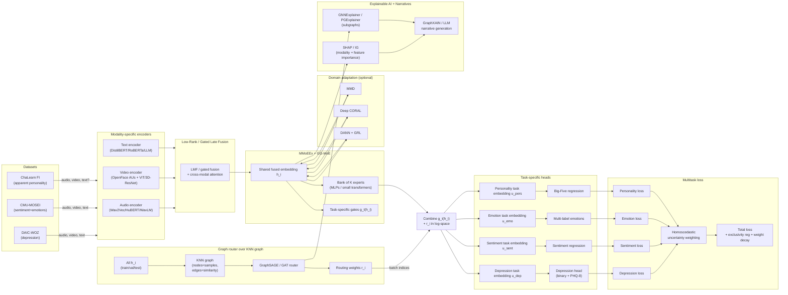
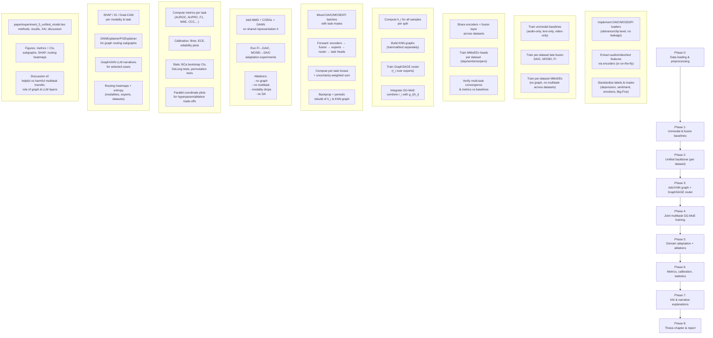

Here are two Mermaid diagrams you can drop straight into your thesis / docs.

***

## Unified architecture diagram

This shows datasets → encoders → fusion → experts + GG‑MoE router → task heads, with domain adaptation and XAI around it. [ppl-ai-file-upload.s3.amazonaws](https://ppl-ai-file-upload.s3.amazonaws.com/web/direct-files/attachments/36215687/1a7d79d8-bdaa-4f89-ac73-642f883e9dff/detailed-plan-2.md)

***

## End-to-end process / flow diagram

This shows the process from data prep → baseline models → unified GG‑MoE training → domain adaptation → evaluation → XAI and thesis integration. [ppl-ai-file-upload.s3.amazonaws](https://ppl-ai-file-upload.s3.amazonaws.com/web/direct-files/attachments/36215687/e7edca1f-d72d-4d67-bdd5-3740325f5e48/deep-research-report-2.md)

